# Subotin-Motors-Portal

Veb aplikacija koja nudi tržište za kupovinu i prodaju polovnih automobila. Omogućava korisnicima da pregledaju širok izbor polovnih vozila i daju ponude za automobile za koje su zainteresovani, pružajući im potencijal da kupe vozilo po nižoj ceni.

## Pregled projekta

**Postoje 2 tipa korisnika na ovom portalu. I oni su**

1.  Krajni korisnici
2.  Administratori

**Korisnici su u mogućnosti da obavljaju sledeće funkcije na portalu**

1.  Registraciju na portal
2.  Prijavu na portal
3.  Postavljanje automobila na prodaju zajedno sa otpremanjem slike
4.  Deaktivaciju postojećeg oglasa
5.  Ažuriranje njihovog profila nakon prijave
6.  Zakazivanje probne vožnje
7.  Objavu ponudne cene

**Administratori su u mogućnosti da obavljaju sledeće funkcije na portalu**

1.  Registraciju na portal
2.  Prijavu na portal
3.  Pregled registrovanih korisnika
4.  Označavanje korisnika kao administratora
5.  Aktivaciju / Deaktivaciju oglasa
6.  Ažuriranje njihovog profila nakon prijave
7.  Odobreti / Odbiti termin test vožnje korisnika na osnovu licitacije
8.  Obavljanje transakcije ukoliko je odgovarajuća cena

**Korisnici i Administratori su u mogućnosti da obavljaju sledeće funkcije na portalu**

1.  Posećivanje početne stranice
2.  Pregled svih oglasa
3.  Potraga automobila na osnovu marke, modela, godišta registracije i raspona cena
4.  About Us Page
5.  Contact Us Page

## Korišćene tehnologije

Backend : Java SE 11, MySQL 8, Spring Boot, Spring Security
Frontend : JSP, JavaScript, Bootstrap

## Kako pokrenuti

1. **Import-ovati postojeći projekat u Visual Studio Code** 
2. **Kreirati MySQL bazu podataka**

```bash
mysql> CREATE DATABASE abc_cars;
```
2. **Podesite 'application propreties'**

```bash
spring.datasource.username=<YOUR_DB_USERNAME>
spring.datasource.password=<YOUR_DB_PASSWORD>
```

4. **Pokretanje aplikacije**

    U terminalu u Visual Studio Code, navigirajte do direktorijuma vašeg projekta:

    sh

```bash
cd C:\Users\David\Subotin-Motors-Portal
```
    Pokrećete aplikaciju koristeći Maven:

sh

```bash
    mvn spring-boot:run
```

Pristup aplikaciji:

    Otvorite web browser i idite na http://localhost:8080.
    Prijavite se koristeći sledeće kredencijale:
        Admin: admin123 / admin123
        User: user123 / user123

Brisanje Browser Cache-a (po potrebi):

    Ako imate problema sa prikazom starih podataka, obrišite keš pregledača za http://localhost:8080.


## Screenshot

<p>Home Page</p>
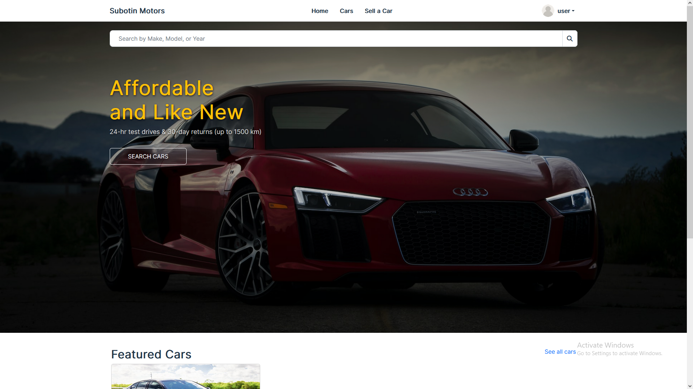
<p>Login</p>
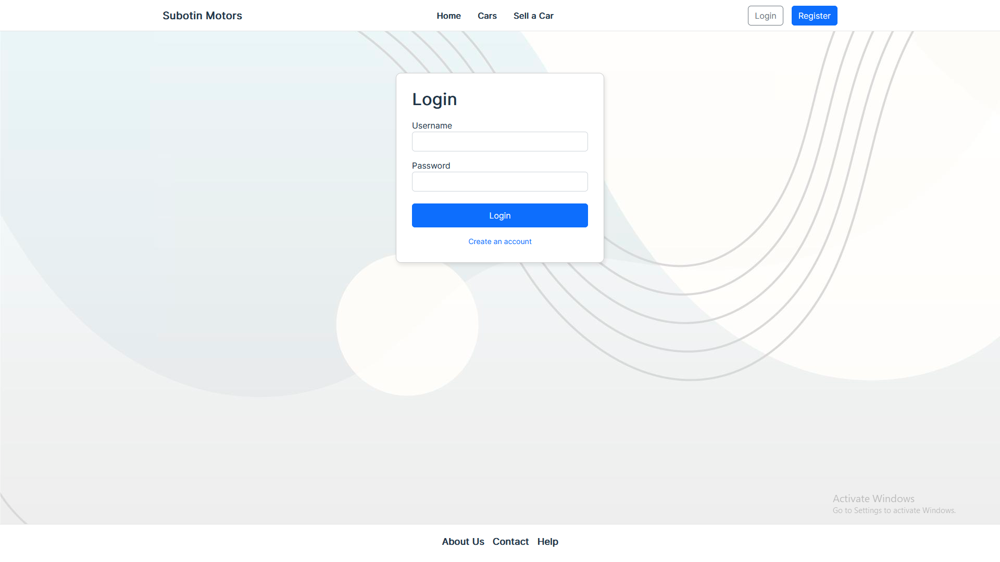
<p>Profile page</p>
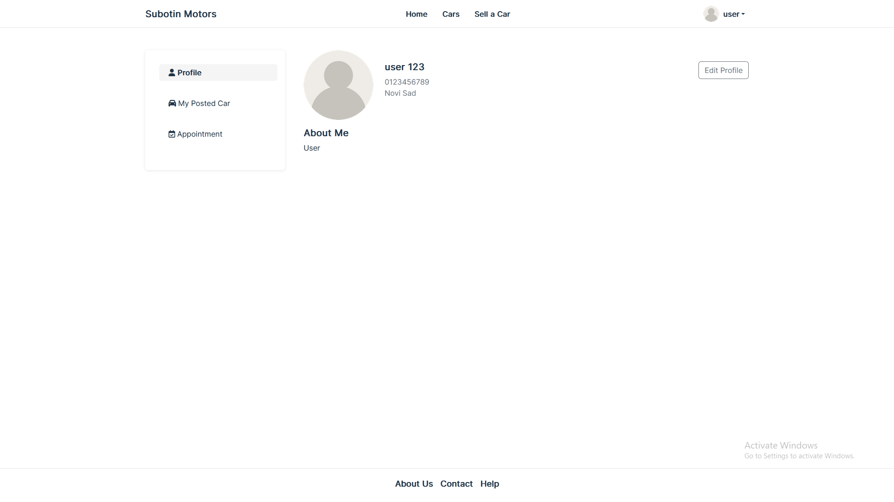
<p>Cars Page</p>

<p>Car Detail Page</p>
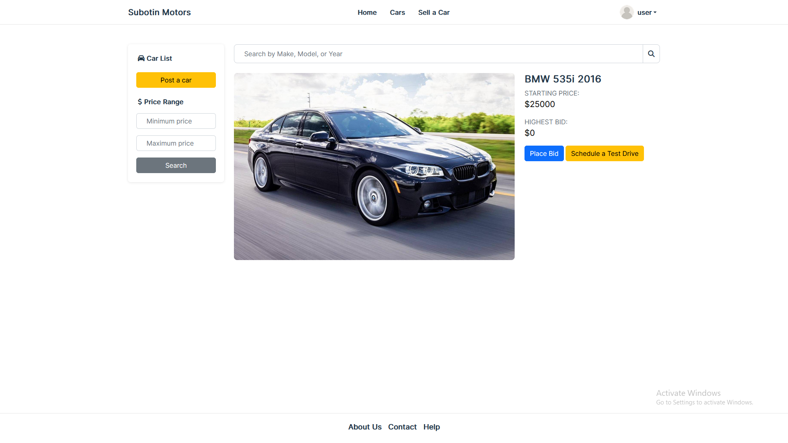
<p>Post Car</p>
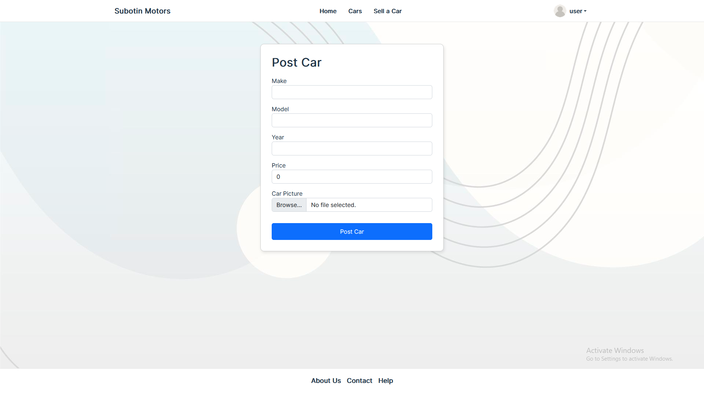
<p>Bid Car</p>
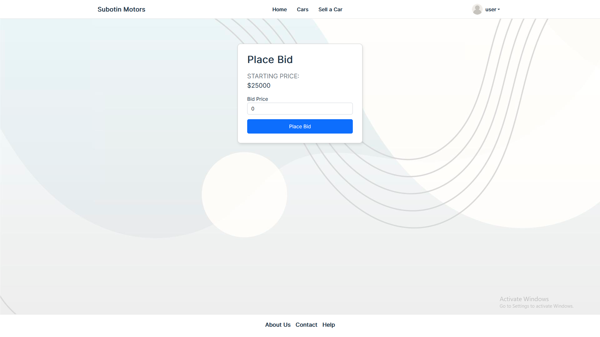
<p>Test Drive</p>
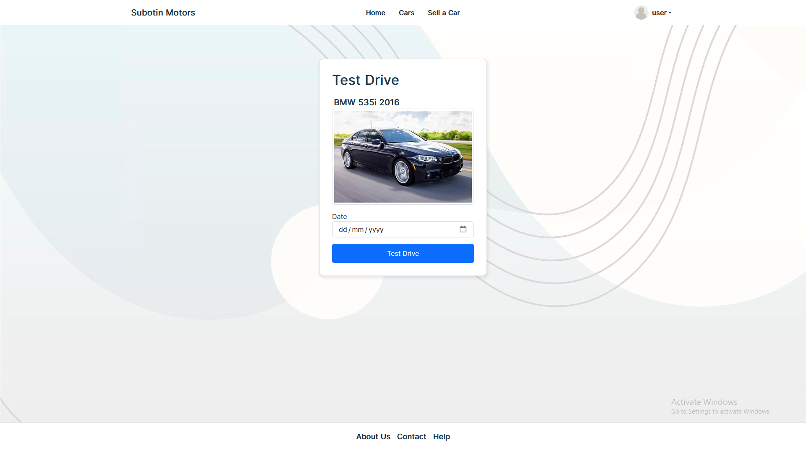
<p>Appointment</p>

<p>My Posted Car</p>
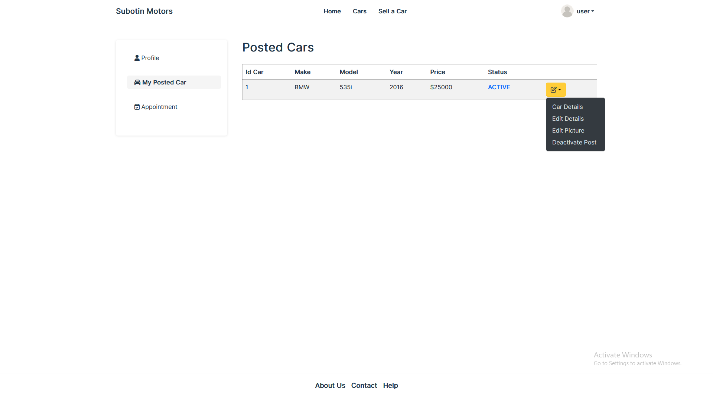
<p>About Page</p>
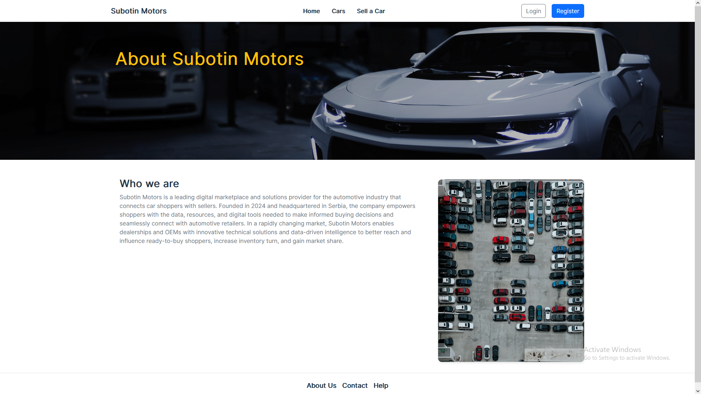
<p>Contact Page</p>
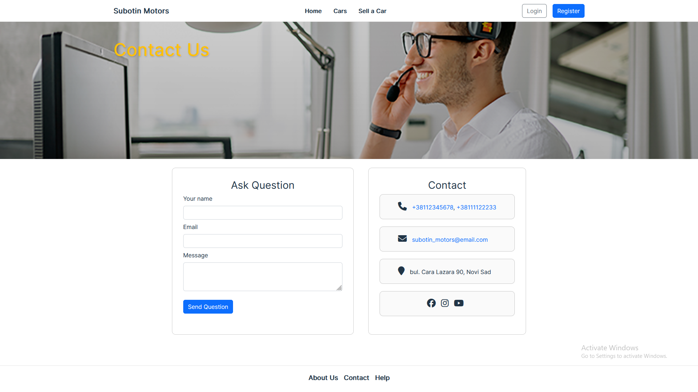
<p>Admin Pages</p>
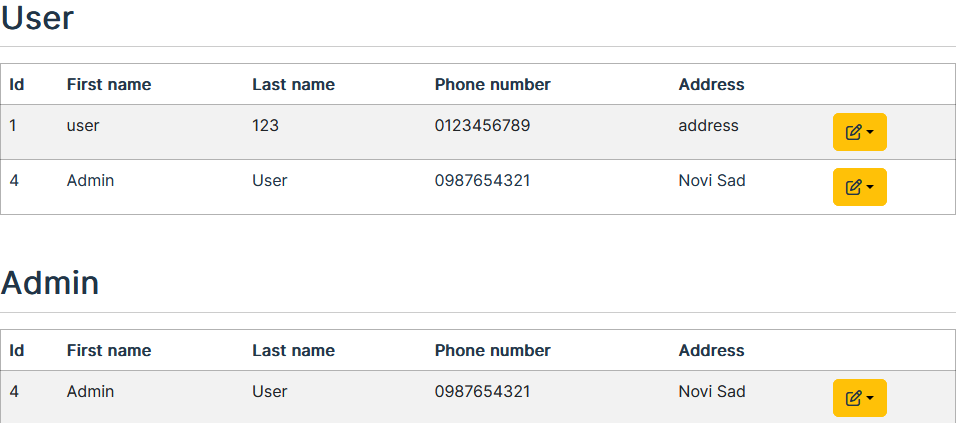

