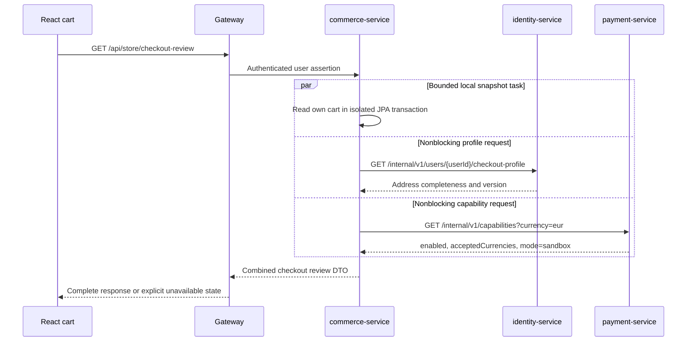
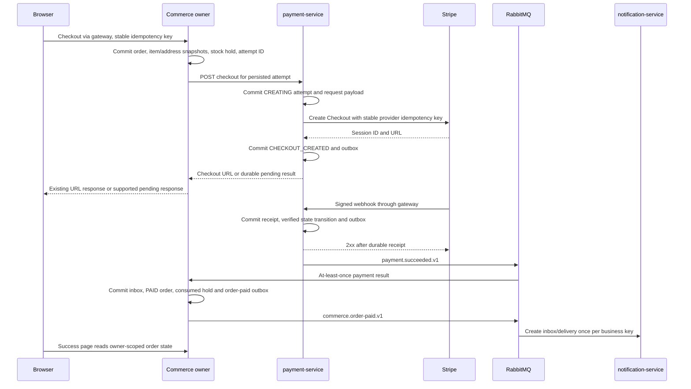

# IROIT API, event contracts and business flows

Current status (2026-09-23): S7 is implemented locally inside the existing
backend. Store and listing-deposit checkout accept `Idempotency-Key`; successful
responses retain `checkoutUrl` and add `attemptId`, `status` and `retryable`.
Ambiguous provider outcomes are durably reconciled and the UI waits for explicit
retry without mutation replay. Verified Stripe events are stored before dispatch,
including unmatched early events. The S8 internal payment REST/event contracts
below remain proposed. See [the implemented contract](checkout-reliability.md).

Current status (2026-09-22): S5 is merged at
`cddde6da41d32d3d37fae9a8eaa71cc4027cca73`, with Backend and Frontend success
verified on that exact commit (Actions run 35673771885). Identity owns sessions,
authentication, accounts and profiles. S6 notification extraction is implemented
and locally accepted in the working tree; see [current ownership/runbook](notification-service.md)
and [actual evidence and pending gates](notification-service-pr.md).
Older dated S4a/S4b/S5 status paragraphs below are historical. Proposed later-stage
architecture does not establish implemented behavior; the S6 runbook takes
precedence for current route, data, session and mail-delivery ownership.

S4a implemented browser contract: `GET /api/csrf` returns only `{token}` with
`Cache-Control: no-store`, creating/reusing an anonymous backend session.
All unsafe API/form/multipart requests now require CSRF; exact signed
`POST /webhooks/stripe` alone is exempt. API rejection is `403` with
`code: CSRF_INVALID`, `message` and `fieldErrors`. `/api/session` is unchanged.
Frontend refreshes tokens after authentication transitions and never replays
mutations automatically. [Full request inventory](session-csrf.md) includes
legacy compatibility and coordinated rollout. Internal APIs/events below remain
proposed; there is no extraction or checkout redesign in S4a.

S3 implements the same S2 route contracts over Compose DNS (`backend`, `frontend`)
and Nginx SPA assets. A single configured public origin supplies redirects, reset
links and Stripe returns. Exact webhook routing and byte preservation remain S2
behavior. [Compose verification](docker-compose-pr.md) adds real MySQL evidence;
the internal APIs, events and distributed checkout below are still proposed.

S2 implemented transport: [`GatewayRoutes`](../gateway/src/main/java/lithan/autostrada/gateway/GatewayRoutes.java)
routes `/api` and `/api/**` to the monolith for every method and the exact
`POST /webhooks/stripe` without reading/rewriting its body. Canonical React
GET/HEAD pages precede legacy route families; other legacy actions remain backend
owned. Cookies, statuses, errors, query encoding and Location are preserved.
Unmatched/private routes return JSON 404, never SPA fallback for API errors.
See [the current route table](../gateway/README.md#route-precedence).
Selected-resource MVC redirects now retain supported IDs. New internal APIs,
composition, RabbitMQ events and durable checkout below remain proposed.

Status: proposed contracts, not implemented endpoints. Existing paths are
identified explicitly. Read with [ownership](iroit-service-ownership.md) and
[security](iroit-security.md). Each extraction PR must commit executable
OpenAPI/JSON Schema contracts and fixtures for its subset; this document is the
design source, not a claim that schema validation already exists.

## Browser compatibility and routing

Keep current paths, query parameters, multipart fields, DTO names, status codes
and redirects during extraction. `front/src/api/client.js` expects JSON errors
with `message` and `fieldErrors` and sends `credentials: 'include'`. Preserve
`ApiModels`, `PageResponse` and summary/session DTO shapes through contract
tests. New fields must be additive until consumers migrate in the same PR.

| Public route family (existing unless marked new) | Final owner / routing rule |
| --- | --- |
| `/api/auth/**`, `GET /api/session`, `/api/user/profile` and `/picture` | identity |
| `/api/public/profiles/{idProfile}` | identity; profile ID is not account ID |
| `/api/public/profiles/{idProfile}/auctions` | marketplace, resolving identity profile-to-user mapping by API/projection |
| `/api/public/auctions/**`, `/api/public/listings/**` | marketplace |
| `/api/public/parts/**`, `/api/public/part-categories` | commerce |
| `/api/public/summary` | small gateway DTO composition of marketplace + commerce |
| `/api/public/content/{page}` | compatibility static response; eventually frontend-owned with matching tests |
| `/api/user/auctions/**`, `/bids/**`, `/appointments`, `/test-drives/**`, `/listings/**`, `/listing-test-rides/**`, `/listing-deposits/**`, `/followed-auctions` | marketplace (all shorthand prefixes here are under `/api/user`) |
| `/api/user/notifications/**` | notification; route before broad user patterns |
| `/api/user/workspace` | gateway DTO composition: identity profile, marketplace auctions/listings/bids, notification unread count, commerce cart count |
| `/api/store/**`, including existing `/payments` | commerce; `/payments` currently returns a retired-auction-checkout message and `/orders` redirect URL |
| `/api/admin/dashboard`, `/api/admin/users/**` | identity; dashboard contains paged users and admins |
| `/api/admin/cars/**`, `/api/admin/bids/**` | marketplace |
| `/api/admin/store/**` | commerce |
| `/api/admin/transactions` | payment; preserve legacy payment/event audit response |
| `/api/comments/cars/**` / `/api/comments/parts/**` | marketplace / commerce; current standalone reads require USER, while public detail DTOs contain comments |
| `POST /webhooks/stripe` | payment; byte-preserving, signature header retained, no browser session requirement |
| `GET /api/payments/{paymentId}` (new) | payment, owner/admin-scoped read; opaque attempt ID |

Gateway composition stays bounded and read-only. Use small domain summary/count
endpoints, never fetch every order/auction to count in the gateway. Initially
mixed endpoints remain in `back/`, replacing extracted-domain repository reads
with clients. Move composition before retiring `back/`. Preserve DTOs on success;
if a required component fails, return a compatible `503` error, not fabricated
zero counts/empty history. More granular partial UI rendering needs a separate
additive frontend change and tests.

Unextracted routes fall back to `back/` only. Once a route is extracted, owner
failure returns a bounded error; it must not silently fall back to stale legacy
data. Order explicit routes before catch-alls. Legacy form actions, uploads and
redirect aliases need their own route catalogue; distinguish these from SPA
GET navigation and never send `/api` failures to `index.html`.

## Business endpoint examples

| Service | Endpoint and request | Response / business rules |
| --- | --- | --- |
| identity | Existing `PUT /api/user/profile`, existing `ProfileRequest` fields: first/last name, phone, structured address and about | Existing `ProfileResponse`; self only; ADMIN edit remains separate. Profile validation and address normalization stay in identity |
| marketplace | Existing `POST /api/user/auctions/{idCar}/bid`, `{"bidPrice":12500}` | Existing message DTO; USER, cannot bid on own/unavailable/closed auction, enforce amount and deadline in local transaction; retain current whole-unit price semantics on this legacy route |
| commerce | Existing `POST /api/store/cart/items`, `{"idPart":42,"quantity":2}` | Existing message DTO; USER, own cart, active product and valid quantity; not a stock reservation yet |
| commerce | New `GET /api/store/checkout-review` | `200` with cart version, total/currency, address completeness, payment availability and checkout blockers; reactive flow below |
| payment | New internal `POST /internal/v1/checkouts`, contract below | Durable idempotent attempt; only authorized commerce/marketplace caller, never accepts a browser-supplied total as authoritative |
| payment | New `GET /api/payments/{paymentId}` | `{"paymentId":"…","businessType":"STORE_ORDER","businessId":"501","status":"PAID","amountMinor":19900,"currency":"eur"}`; owner or ADMIN only |
| notification | Existing `POST /api/user/notifications/{notificationId}/read` | Existing message DTO; recipient only; repeated read does not change original `readAt`; inbox is a business capability, not just an SMTP proxy |

Preserve existing `400` validation, `401` unauthenticated, `403` forbidden and
owner-scoped `404` behavior for old routes. New internal contracts use `400`
invalid input, `401/403` caller errors, `404` inaccessible business resource,
`409` conflicting idempotency payload/state, and `503` transient dependency
failure. Errors keep `message` and `fieldErrors`; add `code` and `correlationId`
for new callers. Use ISO-8601 UTC instants and positive integer minor currency
units for new money contracts. Currency is lower-case ISO currency code; never
float arithmetic. Preserve existing UI date formatting at the compatibility
boundary and explicitly convert legacy local dates/times.

Internal API version starts at `/internal/v1`; it is not routable from browsers.
New list endpoints have bounded pagination (default 20, max 100), stable sort
and no JPA entities. Do not alter existing pagination defaults during extraction.

### Checkout creation and lookup

Commerce or marketplace commits its business reservation first. It then calls
payment outside that transaction with an authenticated service credential and
`Idempotency-Key` tied to the persisted attempt UUID:

```json
{
  "attemptId": "ad7343cb-c784-45cb-b9d0-4a5428bdf881",
  "sourceService": "commerce-service",
  "businessType": "STORE_ORDER",
  "businessId": "501",
  "businessVersion": 1,
  "buyerId": "12",
  "amountMinor": 19900,
  "currency": "eur",
  "description": "Order 501",
  "returnRoute": "STORE_ORDER"
}
```

All fields are required. The caller identity determines allowed `sourceService`
and purposes: commerce -> `STORE_ORDER`; marketplace -> `LISTING_DEPOSIT`.
The legacy backend has these scopes only during coexistence. Payment validates
positive amount/currency, configured limits and that repeated attempt/business
keys have an identical canonical payload. The authenticated owning service is
the authority for the amount; payment does not re-price from a foreign table.
`returnRoute` is an enum resolved to configured public-origin URLs, not an
arbitrary redirect URL. Add order line snapshots only if Stripe display needs
them; they must reconcile to the authoritative total.

Creation returns `201 {paymentId,status,checkoutUrl,expiresAt}` when a session
is ready. A repeat returns `200` for the same result; `202` with
`{paymentId,status:"CREATING",statusUrl}` means accepted but still unresolved.
Internal `GET /internal/v1/payments/{paymentId}` returns current version,
business/owner reference, amount, status and checkout URL where allowed.
`GET /internal/v1/payment-attempts/{attemptId}` also works after a lost creation
response. New attempt UUIDs are never generated just because HTTP timed out.

The owning service uses `POST /internal/v1/payments/{paymentId}/expire` with a
stable idempotency key to request provider expiry. Payment checks caller/business
ownership and returns the authoritative current state, or `202` while unresolved.
Expiry is a request to the provider, not proof that stock may already be released.

The existing browser `POST /api/store/checkout` now returns the additive
`{checkoutUrl,attemptId,status,retryable}` contract. Successful responses retain
the original `checkoutUrl`. S7 pending handling is implemented without exposing
an internal status URL; a user explicitly retries the same key while the backend
reconciler also resumes it. Before remote S8 checkout is enabled, add the proposed
`202 {status,statusUrl}` with
bounded polling of an **owner-scoped public commerce checkout-status endpoint**,
not the internal URL. Preserve the idempotency key across retry/reload until
resolved. The listing-deposit checkout needs the same handling. Show a familiar
pending/retry state without exposing internal service names. Old browser code
that assumes an immediate URL must never be deployed with a 202 producer alone.

## Meaningful reactive interaction: checkout review

Purpose: the cart screen explains whether the signed-in buyer has a complete
shipping address and whether payment-service currently accepts the cart's
currency before the buyer starts checkout. This uses commerce-to-identity and
commerce-to-payment HTTP, not merely browser fetch or gateway proxying.



Proposed response:

```json
{
  "cartVersion": 7,
  "totalMinor": 19900,
  "currency": "eur",
  "hasShippingAddress": true,
  "paymentAvailable": true,
  "canCheckout": true,
  "blockers": [],
  "evaluatedAt": "2026-09-13T19:00:00Z"
}
```

Use WebClient HTTP operations composed with `Mono.zip`, returning
`Mono<CheckoutReviewResponse>` from the commerce MVC endpoint. Do not use
`.block()`, `Future.get()`, `Thread.sleep()` or manual `.subscribe()` in the
request path. Capture the verified principal as an immutable value before
thread changes. Perform the complete local read+DTO mapping in a dedicated
bounded blocking executor; no lazy entity escapes that transaction. HTTP waits
remain nonblocking; JPA and MVC response writing are not presented as reactive
persistence or a fully nonblocking server. Spring documents both
[WebClient's nonblocking API](https://docs.spring.io/spring-framework/reference/web/webflux-webclient.html)
and [MVC reactive return types](https://docs.spring.io/spring-framework/reference/6.2/web/webmvc/mvc-ann-async.html).

Initial tunable budgets: 300 ms connection, 1 s each HTTP response, 2 s overall;
bounded connection pool and local work queue. No retries on this interactive
read initially. Cancellation must cancel downstream requests; queue exhaustion
or required dependency timeout returns `503` with a checkout-unavailable error,
never a false positive. Capabilities means configured ability to accept
payments, not proof Stripe is reachable at the next instant. Review creates no
reservation and grants no permission: checkout revalidates stock/cart version,
loads a current shipping snapshot, and obtains its own durable payment attempt.

Acceptance evidence: two downstream stub requests both observed before either
is released; the MVC request enters async mode; StepVerifier/error/cancellation
tests; real process trace spanning commerce, identity and payment; a bounded
concurrency run demonstrating no HTTP blocking on event-loop threads. Testing
only a `Mono.just(...)` wrapper or gateway routing does not satisfy this design.

## RabbitMQ contracts and delivery rules

Use durable topic exchange `autostrada.events` with per-consumer durable queues,
for example `commerce.payment-results.v1`, `marketplace.payment-results.v1`
and `notification.business.v1`. Messages are persistent JSON. A separate
restricted command exchange `autostrada.commands` carries delivery requests.
Only needed producers/consumers receive broker permissions. Single-node
RabbitMQ is sufficient for the course; it does not claim broker high availability.

Every message uses this required envelope (`payload` varies by type):

```json
{
  "eventId": "31dd3af3-3ef0-49c1-89b7-00eac0c6e07d",
  "eventType": "payment.succeeded.v1",
  "schemaVersion": 1,
  "occurredAt": "2026-09-13T19:01:00Z",
  "producer": "payment-service",
  "aggregateType": "PaymentAttempt",
  "aggregateId": "ad7343cb-c784-45cb-b9d0-4a5428bdf881",
  "aggregateVersion": 3,
  "correlationId": "d75d6e68-ead4-4494-a5f9-9c9fca55ad1f",
  "causationId": "stripe-event-reference",
  "payload": {
    "paymentId": "ad7343cb-c784-45cb-b9d0-4a5428bdf881",
    "businessType": "STORE_ORDER",
    "businessId": "501",
    "sourceService": "commerce-service",
    "buyerId": "12",
    "amountMinor": 19900,
    "currency": "eur",
    "status": "PAID"
  }
}
```

`eventId` is a UUID stable across publish/replay, `aggregateVersion` increases
within that aggregate only, and `causationId` may be null for an initial action.
AMQP headers carry `traceparent`, content type and the same correlation ID.
Keep payloads small and never include credentials, cookies or card details.
Unknown additive fields are tolerated; breaking changes get a new versioned
routing key/schema and a temporary dual-consumer migration. A redrive retains
the original event ID and records its operator/replay reason separately.

| Routing key / type | Producer -> consumer | Required payload beyond envelope |
| --- | --- | --- |
| `marketplace.auction-ending-soon.v1` | marketplace (legacy scheduler temporarily) -> notification | `auctionId`, `recipientId`, `notificationType`, `message`, `auctionSnapshot` sufficient for current inbox DTO, `dedupeKey` |
| `marketplace.test-drive-status-changed.v1` | marketplace -> notification | `appointmentType` (`AUCTION`/`LISTING`), `appointmentId`, `subjectId`, `recipientId`, `status`, `dedupeKey`; `scheduledDate` for date-only auction appointments or `scheduledAt` with explicit offset for listing appointments |
| `payment.checkout-created.v1` | payment -> owning commerce/marketplace | `paymentId`, `sourceService`, `businessType`, `businessId`, `buyerId`, `status`, `expiresAt`; owner gets checkout URL from authorized payment lookup |
| `payment.succeeded.v1` | payment -> owning commerce/marketplace | payment-result payload shown above |
| `payment.failed.v1`, `payment.expired.v1` | payment -> owning commerce/marketplace | same payment-result fields plus `reasonCode` and terminal `status`; emit only after authoritative resolution |
| `commerce.order-paid.v1` | commerce -> notification | `orderId`, `recipientId`, `totalMinor`, `currency`, `dedupeKey`; after commerce commits payment result |
| `marketplace.deposit-paid.v1` | marketplace -> notification | `depositId`, `listingId`, `recipientId`, `amountMinor`, `currency`, `dedupeKey` |
| `identity.password-reset-delivery.v1` (command) | identity -> notification restricted queue | `deliveryId`, `recipientEmail`, `template`, `resetUrl`, `expiresAt`; sensitive, short retention, no general topic broadcast |

The first notification extraction needs ending-soon and reset delivery. Test-drive
and order/deposit confirmations can follow as small additions; they must not
be confused with existing baseline features. Notification delivery records
status/attempts locally; no extra delivery event is required without a consumer.
Identity keeps reset token hash and validity; encrypt the sensitive reset payload
at rest in outbox/delivery storage, restrict broker access, suppress payload logs,
and purge at expiry. Use a dedicated TTL/DLQ policy that cannot re-send expired
reset links. S4a's current development log mode suppresses message contents and
reset links; SMTP is required for delivery. The future delivery service is proposed.

Outbox polling publishes committed rows with publisher confirms and mandatory
routing; mark delivered only after confirmation and successful routing. Lost
confirmation can duplicate delivery. Consumer transaction inserts a unique
`(consumerName,eventId)` inbox record and applies business change/outbox together;
acknowledge only after commit. Rollback leaves no dedupe marker. Handle unique
constraint races as already-processed only after the winning transaction commits.
The separate responsibilities of confirms and acknowledgements are documented
by [RabbitMQ](https://www.rabbitmq.com/docs/confirms).

Initial retry policy: three bounded delayed retries (5 s, 30 s, 2 min, with
jitter in the relay policy) for transient errors, then a DLQ and visible alert.
Use durable retry queues/TTL and confirmed republish before acknowledging the
original, not infinite immediate requeue loops. Validation/unsupported-version
failures go directly to quarantine. Monitor unpublished outbox age, queue depth,
oldest retry age, duplicate count and DLQ count. Repair, then replay the original
message; never delete dedupe entries to force a repeated business effect.

Delivery is at least once, not exactly once. Event-ID dedupe is insufficient for
distinct provider events describing the same outcome: apply idempotent state
transitions, attempt identity and aggregate version checks too. Out-of-order
events with older versions cannot downgrade state. For a gap or contradiction,
query the owner's current state and reconcile; do not assume broker ordering
across retries or producers. Inbox retention must cover all supported replay
history; financial business uniqueness survives any later dedupe cleanup.

## Store checkout: order, stock and payment coordination

Verified current behavior in `StoreOrderServiceImpl`: one transaction validates
shipping/cart, decrements `CarPart.stockQuantity`, creates order/item snapshots,
calls Stripe and clears the cart. Webhook handlers mark paid or restore stock.
`CarPart` already has an optimistic version. Extraction must replace the remote
call inside the transaction with the durable workflow below; current tests do
not prove the future crash/retry behavior.



1. Commerce derives buyer from principal, gets shipping snapshot before its
   transaction, and locks/validates selected parts in a stable order (or uses
   optimistic updates with whole-transaction conflict retry). Persist order,
   item snapshots, stock reservation, checkout attempt ID and idempotency
   request hash atomically. Available stock cannot become negative. The current
   decremented-stock model may remain: reserving subtracts once, paying does
   not subtract again, releasing adds once. Track reservation state explicitly.
2. Consume exactly the cart item quantities/version captured in the transaction;
   concurrent cart changes must conflict or retain newly added items. Browser
   retries recover the same order; they do not consume the cart twice. Payment
   failure leaves an order in history and an explicit add-items-again action
   if wanted; never silently recreate duplicate cart rows.
3. Persist payment request intent before contacting Stripe. Derive the Stripe
   idempotency key from the attempt UUID and persist canonical request fields.
   A crash after provider success but before local save retries the same key
   and reconciles. Once outside the provider's key-retention window, investigate
   by known provider references/metadata; do not blindly create another charge.
   See [Stripe idempotent requests](https://docs.stripe.com/api/idempotent_requests).
4. Payment verifies the raw webhook body/signature and persists a unique
   provider event receipt before acknowledging. Correlate by provider IDs and
   server-supplied metadata, validating mode, amount, currency and business
   reference against the saved attempt. A receipt that is durable but unmatched
   is `PENDING_RECONCILIATION`, not discarded as processed. Retry lookup after
   checkout creation finishes; invalid signatures return 400 and storage failure
   returns 5xx. Unknown irrelevant event types may be durably marked ignored.
5. `checkout.session.completed` alone is not paid: require the verified paid
   state. Asynchronous unpaid completion holds stock pending later success,
   failure or resolved expiry. Never publish a payment success from a browser
   return URL. Stripe explicitly documents duplicate and unordered webhook
   delivery and signature verification in its [webhook guide](https://docs.stripe.com/webhooks).
6. Commerce atomically validates attempt/business/amount/currency, deduplicates,
   updates its order/reservation and emits the next event. Payment never writes
   commerce tables. Notification failure cannot unpay the order.

| Situation | Required recovery / invariant |
| --- | --- |
| Duplicate browser request / different payload with same key | Same request returns same order/attempt; conflicting payload returns 409 |
| Stock contention | One local transaction wins; loser gets stock/conflict error; no oversell and no orphan hold |
| Timeout before/after payment accepts request | Keep `CHECKOUT_PENDING`, reconcile by attempt ID; background worker retries persisted intent; browser receives pending status |
| Stripe disabled or definitive create rejection with no session | Mark create failed, issue terminal result, release hold exactly once; do not release on an ambiguous timeout |
| Browser cancel/close/success redirect | Navigation only. Keep pending hold until provider state is resolved; success page may show payment processing |
| Reservation deadline reached | Request idempotent provider-session expiry through payment and check current state. Release only on confirmed unpaid terminal state; unknown/processing stays held with an alert |
| Failure/expiry event before or after success | Terminal PAID cannot be downgraded. Validate version and reconcile conflicting authoritative state before release |
| Payment success after hold was already released | Set `PAYMENT_REVIEW_REQUIRED`; record paid provider state, block fulfillment and alert admin. Do not mark order fulfilled, silently oversell or charge again; reconcile/refund with audit |
| Broker offline | Owner DB/outbox commits remain durable; relay retries; pending UI is truthful. Alert on age; no synchronous notification dependency |
| Consumer dies after commit but before ack | Redelivery sees inbox/business transition and performs no second stock change |
| Poison result / mismatched amount or business ID | Quarantine, retain hold if unresolved, alert; no automatic success/release |
| Missing callback for an old attempt | Payment reconciliation job retrieves provider state; emits the same normalized transition machinery as webhooks, with durable audit |

Order states proposed: `CHECKOUT_PENDING -> AWAITING_PAYMENT -> PAID`, or
`CREATE_FAILED / PAYMENT_FAILED / EXPIRED` after resolution; exceptional
`PAYMENT_REVIEW_REQUIRED` is explicit. Payment states are independent:
`CREATING -> CHECKOUT_CREATED -> PROCESSING -> PAID` or terminal
`CREATE_FAILED / FAILED / EXPIRED`. Not every flow needs PROCESSING. Map states
to existing customer/admin views and test every new label; do not reuse one
ambiguous status as both provider truth and fulfillment truth.

## Listing deposits and notification eligibility

Marketplace locks an active listing, rejects self-reservation, and creates one
active deposit reservation with a payment attempt. It keeps its current rule
that the listing is RESERVED during checkout. Deposit failure/expiry releases
only if that exact deposit still owns the reservation; an old event must not
reactivate a listing reserved by another attempt. Paid deposit remains RESERVED,
not SOLD. Use the same pending, dedupe, unknown-payment and late-success review
rules as store checkout, without a stock counter. Import/resolve pre-cutover
sessions before moving `/webhooks/stripe`; keep legacy retired auction-payment
history in payment and reconcile pending legacy records explicitly.

Marketplace retains ending-soon eligibility and watchlist recipients. Both
scheduled scanning and a new follow inside the ending window create a durable
intent keyed by `(recipientId, auctionId, ENDING_SOON)` to preserve current
one-notification behavior. Notification owns storage/read/delivery. Import
existing notifications with that key and read timestamps to prevent duplicates
on the first scan. Following/unfollowing after intent creation does not retract
already created inbox history. SMTP retries may duplicate an external email
after an ambiguous provider acknowledgement; claim once-only inbox insertion,
not exactly-once email delivery. Prefer a provider idempotency key if supported.
