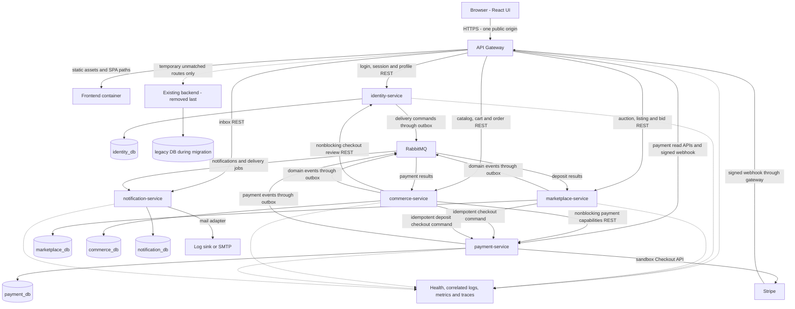

# IROIT target architecture and decision record

**Selected course scope (2026-09-25):** S8 is merged at
`5ee4cb8b5c0445b8ffded0577709475cd876af8e`; Backend and Frontend passed on that
exact commit. Its local CD run failed; deployment success is not established.
The owner has deferred S9-S11 service extraction. The selected delivery keeps
backend, identity, notification and payment as four application owners, plus
the gateway. Commerce/marketplace coupling remains in backend. Continue with
static analysis, observability/reactive evidence, then defence preparation.
This decision supersedes later "next S9" statements and the five-service target;
the extraction chapters remain a future design, not acceptance requirements
for this delivery. See [the current requirement matrix](iroit-requirements-status.md).
Earlier dated paragraphs below are historical records.

Current status (2026-09-24): S7 is merged on `master` at `42cde105`. S8 is
implemented in the focused working tree: payment-service now owns provider
checkout, signed receipts, reconciliation, copied payment audit data and the
terminal-result outbox; backend keeps stock/order/listing invariants and consumes
normalized results. See [implemented S8 ownership and recovery](payment-service.md)
and [actual evidence/pending gates](payment-service-pr.md). S9 and later remain
proposed. Older status paragraphs are historical.

Current status (2026-09-22): S5 is merged at
`cddde6da41d32d3d37fae9a8eaa71cc4027cca73`; exact-commit Backend and Frontend
checks passed (Actions run 35673771885). Identity owns accounts, profiles and
sessions. S6 notification extraction is implemented and locally accepted in the
working tree. See [current ownership and recovery](notification-service.md)
and [actual evidence/pending gates](notification-service-pr.md). Earlier dated
status paragraphs are historical; later-stage designs remain proposed.

Current S4a working-tree status (2026-09-20): S3 is merged as `8d13104`; Backend
and Frontend passed on that exact commit. [S4a](session-csrf.md) implements the
session-backed CSRF endpoint, all unsafe request validation, API/form session
rotation and coordinated frontend recovery in the existing backend. See
[measured evidence](session-csrf-pr.md). No S4a commit/merge is claimed. Next is
S4b identity boundary preparation; the five-service target remains proposed.
The dated S3 and design-stage paragraphs below are historical records.

Implementation status, S3 (2026-09-19): S2 merged as `a08cb14`, with successful
Backend/Frontend checks on that exact master commit. [S3 container baseline](docker-compose.md)
adds gateway, private frontend assets/backend and persistent MySQL; backend remains
the sole business/session owner. Local evidence and remaining remote/manual gates
are in [the S3 handoff](docker-compose-pr.md). S4+ and the five-service target below
remain proposed. No S3 commit/push/merge or baseline tag is claimed.

Historical S2 implementation (2026-09-14): S1 merged as `35007b5`; the new
[`gateway/`](../gateway/README.md) proxies the monolith and serves the frontend
through one public origin. Backend still owns sessions, permissions, persistence
and payments. Browser regression now traverses the gateway. See
[S2 verification and handoff](api-gateway-pr.md). The five-service diagram and
session exchange below remain **proposed**; see the current S3 status above.

Status: proposed implementation baseline for review, 2026-09-13. The user's
constraints below are agreed inputs; the selected architecture is a design
proposal until reviewed and merged. Nothing here describes already extracted
services. Future tasks should update these files when a decision changes and
record implementation evidence against the migration stages.

## Reading order and authority

| Document | Purpose |
| --- | --- |
| [Baseline](iroit-baseline.md) | Verified source/CI baseline and owner-run tag commands |
| This file | Requirements provenance, diagram, service boundaries and choices |
| [Service ownership](iroit-service-ownership.md) | Current entities/tables, controllers, services and data migration |
| [API and events](iroit-api-events.md) | Routes, contracts, REST/reactive/messaging flows and payment coordination |
| [Security](iroit-security.md) | Session migration, gateway, cookies, CSRF, roles and internal trust |
| [Migration plan](iroit-migration-plan.md) | Ordered stages, acceptance/recovery gates and focused branches |

These six documents are the shared IROIT architecture source of truth. Existing
`documentation/` files describe the application and earlier submission work;
their readiness statements are not evidence that the microservices course is
complete. Actual code remains authoritative about implemented behavior.

## Requirements and evidence

Repository inspection covered the root/backend/frontend READMEs, `docs/`, both
English and Serbian project documents, application code, Flyway V1-V18, and CI.
No original IROIT course specification, PDF, Word document, or assessment rubric
was found. No previously supplied course attachment is available in this task's
context. In particular, the older documents reference writing/submission
guidelines without supplying the original requirements. Do not infer new course
requirements from their claims of readiness.

| Item | Provenance | Treatment |
| --- | --- | --- |
| At least four business microservices plus a gateway; frontend/DB/broker do not count | Earlier assessment, reported in the user's brief; original rubric unavailable | Plan five business services plus gateway; verify counting rules against the original rubric before the final course audit |
| REST, RabbitMQ and meaningful nonblocking reactive service-to-service interaction | Explicit deliverable in this task; exact course wording unavailable | Demonstrate all three with business flows in the contracts document |
| Preserve React functionality; gateway first is encouraged; explicit ownership; tests, containers, CI, observability per service; E2E before critical changes | Explicit user instructions | Migration gates, not optional cleanup after extraction |
| Java 17, Boot 3.5.15, Maven, MVC/JPA/Flyway, React/Vite, H2 tests and MySQL profile | Verified code/configuration | Retain initially; choose compatible Spring Cloud versions in the gateway task |
| Sessions, credentialed CORS, signed Stripe webhooks | Verified code | S4a removes the historical API CSRF exemption; retain session/role/ownership boundaries |
| Docker/Compose, CD and complete observability | Requested implementation planning; no course detail available | Plan concrete delivery/evidence stages; hosting platform and exact telemetry rubric remain open |
| Required CI checks `Backend` and `Frontend` on `master` | User-reported protection; workflow job names verified | Preserve these names or migrate protection deliberately; never silently bypass new services |
| Five schemas, outbox/inbox, session exchange, reactive checkout review | Design choices in this proposal | Review through implementation PRs; not claimed as course mandates |
| Seven npm vulnerabilities from the last install | User-reported, not re-audited here | Separate dependency remediation task; no lockfile edits here |

Unknown course details include approved technology/version constraints, whether
notification/identity count as business services, whether the reactive server
itself must be WebFlux, required deployment platform, and exact monitoring/CD
evidence. These are verification questions, not reasons to block gateway and
E2E foundations. Four core services remain even if notification is excluded;
do not assume the rubric necessarily accepts identity without checking it.

## Target diagram

Each database cylinder denotes exclusive logical ownership, not a required
separate MySQL server. For the course deployment, one MySQL container with
separate schemas and restricted credentials is sufficient. The diagram shows
business dependencies; it omits routine service credential acquisition and
observability transport for readability. Final deployment has five business
executables, one gateway, one frontend, MySQL and RabbitMQ. The legacy backend
and legacy schema exist only during coexistence.

## Boundaries selected for the proposal

| Component | Owns and enforces | Does not own |
| --- | --- | --- |
| identity-service | Registration, account uniqueness, BCrypt hashes, profiles and profile images, roles, authentication/session lifecycle, reset token issuance/consumption, public seller identity | Auction ownership rules, stock, payment state or notification inbox |
| marketplace-service | Auctions and bids, moderation, vehicle listings/images, both test-drive models, follows, auction comment discussion, listing reservation/deposit business state, ending-soon eligibility | Passwords, parts, Stripe credentials, payment settlement or message delivery |
| commerce-service | Parts/category values, stock, cart, order and item snapshots, shipping snapshot, checkout orchestration, stock reservations/releases, part discussions and store administration | Identity source records or provider settlement |
| payment-service | Sandbox Stripe adapter, provider account/payment audit, checkout attempts, webhook authentication/deduplication, authoritative provider payment state, reconciliation and payment-result events | Modifying stock, marking a vehicle sold, calculating cart totals from browser input |
| notification-service | User inbox, read state, delivery jobs, templates, attempts and retry policy; email/log adapter | Determining auction deadlines/recipients, generating or consuming password-reset tokens |
| API Gateway | Public origin, explicit routes, session-to-service authentication bridge, request limits, correlation, limited read-only response composition | Business transactions, JPA repositories, a business database, or final resource permission decisions |

Keep stock and orders together: their local invariant is stronger and simpler
than a separate inventory saga. Keep auctions, bids and test drives together:
the same owner/deadline/vehicle state governs them. Five services are justified
by responsibilities; do not add a comments, catalog, cart, scheduling or
configuration service merely to increase the count.

`ListingDeposit` is a **marketplace reservation** plus payment reference after
migration. Its Stripe fields migrate into payment-owned attempts. A paid
deposit reserves a listing; it is not a full vehicle sale. Auction Checkout and
seller onboarding are retired public flows in `PaymentController`, despite
remaining payment classes/tests. Preserve their audit data and redirects;
this architecture does not propose reactivating them. Current admin bid
approval directly accepts the bid and marks its car sold within marketplace.

## Implementation choices and limits

| Decision | Rationale / consequence |
| --- | --- |
| One repository; independent `services/<name>/` builds and `gateway/`; retain `front/` and `back/` during migration | Manageable for one student; each executable has its own pom/wrapper, Dockerfile, configuration and README. No compile-time dependency on `back/` or another service's entities |
| Gateway first, preserving `/api/**`, webhook and legacy behavior | React need not learn service hostnames or change every URL at each extraction |
| Spring MVC/JPA for business persistence; Spring Cloud Gateway Server WebFlux at the edge | Reuse existing code and skills. Gateway must not call JPA/Stripe on its event loop; pin a Java 17 / Boot 3.5 compatible release train at implementation |
| Commerce implements a reactive checkout review with WebClient and `Mono` | Real nonblocking HTTP fan-out to identity/payment, plus bounded isolated blocking JPA work. Not a claim that persistence or every service is reactive |
| Sessions remain a browser contract; identity owns them after cutover | Avoid browser token storage and shared session tables. Gateway obtains short-lived internal assertions; services validate and authorize independently |
| MySQL schemas/users per owner; Flyway per executable | Same physical DB is an economical deployment option; no cross-schema joins, foreign keys or runtime grants |
| RabbitMQ introduced with notification extraction | Concrete event delivery use case before payment distribution; durable outbox/inbox handles crashes without distributed transactions |
| Compose DNS, environment configuration, one instance per service initially | No discovery server, config server, Redis, service mesh, Kubernetes or CDC platform without a demonstrated need or verified rubric mandate |
| Health and correlated logs from first container; metrics/traces when communication appears | Debug route/auth/message failures while extracting. Final small observability profile: Prometheus, Grafana and a trace backend such as Tempo |
| Short write freeze for course data cutovers | Deterministic export/import and recovery are practical. Zero-downtime dual writes are not a requirement supplied here |

The original architecture task changed no application behavior. S4a now ships
CSRF tokens with matching frontend and E2E evidence. Later asynchronous pending
states or identity-cutover re-login must likewise ship matching frontend support.
Keep familiar screens and actions;
do not expose internal service terminology in the UI.

## Open questions to carry forward

1. Locate the original IROIT rubric and record section/page citations, especially
   service counting, reactive interaction, CD and observability requirements.
2. Confirm a deployment host, public HTTPS origin, secret mechanism and budget
   before CD. Start with Compose; no host or cloud account is chosen here.
3. Validate the deployed MySQL data/time zone before migration. Existing
   `LocalDateTime` values need a documented source zone; do not silently assume UTC.
4. Confirm course acceptance of MVC endpoints returning a reactive `Mono` with
   nonblocking HTTP clients. If it requires a fully reactive business server,
   revise this bounded choice before commerce implementation, not all services.
5. Decide the sandbox procedure for exceptional paid-but-unfulfillable orders.
   Proposed default: hold for administrator reconciliation/refund, retain audit,
   and never report fulfillment success automatically.

The [browser E2E implementation and evidence](browser-e2e.md) now tests the current
monolith through the S2 gateway; the service target architecture remains proposed.
After S4a merges with successful merged-master checks, next is S4b identity boundary preparation.
The owner can create the baseline tag independently using the verified SHA.
