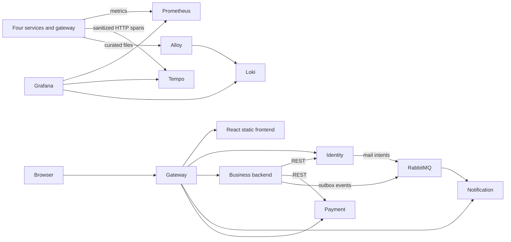

# Defence guide — Autostrada Auctions

This guide follows the supplied Serbian specification in its original order.
Use the actual green CI/CD run and local verification reports as evidence. A
configuration file proves intent; a successful run proves that the configuration
worked. Do not describe an unverified feature as demonstrated.

## Opening explanation (about 45 seconds)

“My project is Autostrada Auctions, a vehicle auction, classified listing and
parts-store application. It has four independently built application services:
identity, notification, payment and the remaining business backend. A Spring Cloud
Gateway is the public entry point and React supplies the interface. Each service
owns its data, although the local deployment shares one MySQL server with separate
schemas and credentials. REST handles request/response communication, RabbitMQ
handles asynchronous events, and the gateway uses reactive WebFlux/WebClient.
GitHub Actions tests changes and deploys a successful master revision onto my local
Docker Desktop host. Grafana provides metrics, logs and distributed HTTP traces.”

Do not count MySQL, RabbitMQ, Grafana or the frontend as the four business services.
Do not claim commerce/marketplace extraction or retirement of the remaining backend.



This diagram shows communication, not a claim that one distributed trace crosses
every arrow. Each application owner uses its own MySQL schema and credentials;
those connections are omitted here for readability.

## 1. Initial application and microservices

Show `compose.yaml`, the four build directories, and `gateway/src/main/java/lithan/autostrada/gateway/GatewayRoutes.java`.

| Process | Ownership | Example endpoint |
| --- | --- | --- |
| backend (`back/`) | Auctions, listings, parts, carts/orders, ownership and checkout coordination | `GET /api/public/auctions` |
| identity | Accounts, profiles, sessions, login, account administration | `GET /api/session` |
| notification | Inbox and mail delivery | `GET /api/user/notifications` (USER required) |
| payment | Provider operations, payment records, signed webhook ingress | `POST /webhooks/stripe` (valid signature required) |
| gateway | Public routing, boundary hygiene, session/assertion exchange | Public API forwarding and health |

Explain: the browser uses one origin; internal services and metrics ports are not
published. Identity owns the session. Business services receive validated assertions,
not a second password database. Roles, account ownership and CSRF remain enforced.

REST example: gateway exchanges a session with identity; backend obtains a batch
profile response from identity. Queue example: ending-soon events are persisted in
an outbox, published to RabbitMQ and consumed by notification with deduplication.
Payment results likewise use RabbitMQ. An outbox avoids losing a message between a
DB commit and broker publication; an inbox handles repeated deliveries.

Reactive example: `gateway/.../IdentityBridge.java` composes a nonblocking WebClient
request with the downstream filter chain. Show `ReactiveTraceTests`: two exchanges
reach a held peer before either returns, then complete with separate child spans.
The gateway has bounded timeouts/capacity and does not replay mutations. The backend
JDBC/JPA code remains blocking; do not call the entire system reactive. gRPC is
optional and is not an implemented business transport.

Logs/metrics/traces: see item 10. HTTP tracing does not prove an uninterrupted trace
through the RabbitMQ outbox/consumer; do not draw that as an implemented trace.

## 2. Git workflow and versioning

Open the GitHub repository and Pull requests → Closed. Show feature branches and
reviewed PRs, then a merge into `master`. `master` is this project's stable default
branch, equivalent to the specification's `main`; it is not necessary to rename it.
Explain that Git tracks source changes and GitHub hosts the repository, PRs and
Actions. The owner stages, commits, pushes and merges. Branch protection must
require Backend and Frontend; show the actual repository setting rather than
claiming a YAML file alone configures branch protection.

## 3. Testing

Show one Java authorization test, `MetricsBoundaryTests`, `TracePrivacyTests`, a
frontend test and `front/e2e` browser scenarios. Explain unit versus integration
versus E2E: isolated logic, real component boundaries and a browser using the UI.

Show Surefire, frontend and Playwright artifacts from the latest successful CI.
H2 tests are not MySQL evidence. The Compose harness separately checks real MySQL
migrations/cutovers, constraints and failure/recovery using unique disposable
projects. Simulated payment success is not a real Stripe transaction. Never use a
live customer or normal development database for destructive demonstrations.

## 4. CI pipeline

Open `.github/workflows/ci.yml` and the Actions run side by side.

Explain `on: push` and `pull_request`, jobs, steps, runners, checkout and Java/Node
setup. Backend builds/tests the Java owners and gateway, runs PMD and container/
MySQL integration. Frontend runs ESLint, tests/build, and browser regressions.
Observability configuration checks must succeed before Backend can succeed;
Windows environment-script compatibility is also a prerequisite. Artifacts retain
reports and distributable builds. A failed required job blocks merging.

CI checks a change; it does not itself mean the change is deployed.

## 5. Docker containerization — likely oral questions

Open `services/payment-service/Dockerfile` and `front/Dockerfile`.
Walk down the real file, explaining:

- `FROM ... AS build`: a build environment with the JDK or Node tooling.
- `WORKDIR`, `COPY`, and wrapper/package files: inputs and reproducible build steps.
- `RUN ... verify` / frontend build: compile and test during image construction.
- Second `FROM`: smaller runtime with JRE or web server, without build tooling.
- `COPY --from=build`: copy the built artifact into the runtime image.
- `USER`: run application code without root privileges.
- `ENV`, `EXPOSE`, `HEALTHCHECK`, `ENTRYPOINT`: defaults, documented container port,
  readiness probe and the command started when the container runs. EXPOSE does not
  publish a port; Compose `ports` does.
- `.dockerignore`: exclude irrelevant files, secrets and local outputs from the
  build context. Inspect one actual file.
- Base digests pin application base images; CD tags release images with the full
  Git SHA. A tag is a label and is not inherently immutable.

**Docker:** tools and a runtime for building images and running isolated processes.
**Image:** layered, read-only template containing application/runtime dependencies.
**Container:** a running (or stopped) instance of an image, with process isolation,
network configuration and a writable layer. Multiple containers can use one image.
**Docker Engine:** daemon/runtime that manages images, networks, volumes and containers.
**Docker Desktop:** Windows desktop package integrating the engine, CLI and Linux VM/
WSL-based environment. Opening the UI is not proof that the engine is ready;
`docker version` must report a server.
**Dockerfile:** recipe for building one image.
**Docker Compose:** tool reading a declarative YAML model to start/manage multiple
services together, including their networks, environment, health and volumes.
**Volume:** data storage separate from a container's writable layer. Replacing a
container can preserve MySQL data in its named volume.
**Container versus VM:** containers share the host kernel; a VM has a guest OS/kernel.
On Windows these Linux containers run inside Docker Desktop's Linux environment.
**Build versus run:** build creates an image; run/up creates and starts containers.
**Stop versus down:** stop preserves containers; down removes project containers and
networks; `down --volumes` also deletes named data and must not be used on the deployment.

Safe commands to explain (do not dump environment secrets):

```powershell
docker version
docker compose version
docker image ls
docker ps --format 'table {{.Names}}\t{{.Image}}\t{{.Status}}\t{{.Ports}}'
```

A registry upload is optional for this fully local project. SHA-tagged local images
are sufficient for the selected deployment model.

## 6. Compose orchestration

Show `compose.yaml` and `compose.observability.yaml`.
Explain service DNS names such as `identity`, `depends_on` health ordering, private
networks, host-loopback bindings, environment interpolation and persistent volumes.
Passwords live in `C:\AutostradaDeploy\autostrada.env`, not source control; do not
project that file on screen. Multiple schemas on one MySQL server are a local
resource choice, not a claim of separate physical database servers.

The monitoring overlay is optional and adds no collector dependency to application
startup. Grafana alone has a browser-facing loopback port. The services' 9080
management listeners and collector APIs are private.

## 7. Static analysis

Show `quality/pmd-ruleset.xml`, a POM's `static-analysis` profile,
`front/eslint.config.js` and their CI steps. PMD checks selected likely defects,
dead code, concurrency mistakes and insecure cryptographic constructs. ESLint
checks JS/JSX errors and unsafe constructs. Explain the documented, narrow V21
CheckResultSet exception; applied migrations were not rewritten to satisfy a rule.

This is selected rule coverage, not proof of zero vulnerabilities or a completed
penetration test. Show successful analysis artifacts for the revision being defended.

## 8. Deployment

Show Docker Desktop's running project and the application at `http://localhost:8081`.
Local containerized deployment is explicitly allowed; no public cloud URL is needed.
Health proves process/dependency readiness, not every business flow.
Use the startup procedure in `observability.md`; do not initialize or
copy a new empty database just before the defence.

## 9. Continuous deployment

Open `.github/workflows/cd-local.yml`, `deploy/local/Deploy-Local.ps1` and
`deploy/local/Common.ps1`. Explain that successful **push CI on master**, following
a merge, triggers the separate CD workflow. PR CI runs on hosted runners; deployment
uses the labelled Windows self-hosted runner on this computer. The workflow checks
the SHA belongs to master, builds SHA-tagged release images, backs up data, performs
guarded upgrades, starts Compose and checks the public origin. Monitoring is
included when enabled in the private host environment.

Show a successful CD run, its exact SHA and sanitized deployment artifact. A queued
run normally needs the runner online/eligible (or an environment approval); it is
not a successful deployment. `run.cmd` is the runner listener, not the application.
Docker Desktop and the runner must both be available. No application terminal is
needed when Compose already runs the deployment.

Rollback is deliberate: never restore stale identity/password/role/reset or payment
state after new writes. A forward fix is usually safer. Monitoring can be disabled
without restoring any business database. See the runbook.

## 10. Monitoring and observability

Open Grafana at `http://localhost:3001`, sign in privately as `observer`, then open
**Autostrada — service health**. Generate traffic by browsing and logging in; allow
multiple scrapes (15-second interval). Explain:

- Throughput: requests per second over a five-minute rate window.
- Error rate: HTTP 5xx / all responses. 401/403 are excluded from this server-error
  ratio. No traffic is shown as no ratio, not a false healthy zero.
- Latency: p95 computed from histogram buckets; about 95% of observed requests were
  at or below that duration, not the average.
- Availability: scrape success, which is different from business readiness.
- Alerts: sustained unreachable service, error ratio and latency; demonstration
  thresholds are not formal SLO promises. No external paging is configured.

In Explore select Loki: `{service="gateway"}`. Show method, status, duration,
trace_id and span_id, with service supplied as a label. Use the TraceID link to
Tempo; show a request spanning gateway/backend/identity. Names are deliberately
coarse (`SERVER`, `CLIENT`); sensitive paths and payloads are excluded before export.
Do not promise a trace through the browser itself or RabbitMQ consumer.

Logs explain individual requests; metrics show aggregated trends; traces connect
work across HTTP services. Alloy discovers request files in read-only volume mounts;
no Docker socket is exposed. Files roll, Loki and Tempo retain three days, Prometheus
has time/size retention. Trace sampling is 100% for this local demonstration, not a
production-scale recommendation. Telemetry is operational data, not an audit ledger.

For a controlled failure demo, prefer stopping **Tempo only** and showing the
application still responds, then restart it using the same deployment configuration.
Do not stop MySQL during a live payment or delete any volume. The disposable
integration reports provide evidence for database/broker failures.

## Application walkthrough (10–15 minutes)

Use separate browser profiles for a normal USER and ADMIN. Prepare accounts and
non-sensitive demo content beforehand; do not show passwords or secret env files.
Choose IDs by clicking existing records, not by guessing URLs.

| Page | What to show and say |
| --- | --- |
| `/` | Explain purpose, navigation and the single gateway origin. |
| `/register`, `/login` | Register a disposable presentation user, show validation and login. Identity owns the session. |
| `/user/profile`, `/user/profile/edit` | View/edit own profile and upload a small picture. Own private information is authorized. |
| `/profiles/<id>` | Public profile deliberately redacts private identity fields. |
| `/auctions` | Browse/filter auction inventory; open one active vehicle. |
| `/auctions/<id>` | Images/details, bid or follow using a user who is not its owner; explain ownership and validation. |
| `/user/followed-auctions`, `/user/bids` | Show watchlist and the user's bids. |
| `/user/appointments` | Show test-drive/appointment records after booking through an auction. |
| `/listings`, `/listings/<id>` | Fixed-price listings, details and deposit entry point. Explain payment availability before clicking. |
| `/user/auctions`, `/user/auctions/new` | Seller's records and creation/edit flow; use prepared demo content. |
| `/user/listings`, `/user/listings/new` | Seller's classified listing management. |
| `/parts`, `/parts/<id>`, `/cart` | Search/browse parts, add a part, change quantity, demonstrate totals and stock validation. |
| `/orders`, `/orders/<id>` | Order state/history; durable checkout attempt and idempotency prevent duplicate creation. |
| `/user/listing-deposits` | User-owned deposit records. |
| `/user/notifications` | Unread count and mark-read; explain the RabbitMQ/outbox/inbox path with existing test evidence. |
| `/forgot-password` | Generic request response; do not claim email delivery unless SMTP was configured and tested. Never expose reset tokens. |
| `/admin/users` | Separate ADMIN session; show account administration and role restrictions. |
| `/admin/cars` | Marketplace moderation, separate from identity administration. |
| `/admin/store/parts`, `/admin/store/orders` | Inventory/order management and validation. |
| `/admin/transactions` | Explain the displayed legacy/available records; do not present retired payment onboarding as active. |
| `/about-us`, `/contact-us` | Static content pages; no need to spend much demonstration time here. |
| logout + protected page | Show that a session is required. A USER does not gain ADMIN access by changing a URL. |

Payment demonstration: if real Stripe sandbox has not been configured and verified,
show the automated browser test/trace/report for the simulated provider instead.
Do not enable test controls or fake payment providers in the permanent production
image. A browser return page alone is not proof of a successful payment; the signed
provider event/result updates the authoritative state.

Finish with GitHub → green CI → merged SHA → green CD → application health → Grafana.
Keep screenshots/reports as backup, but distinguish recordings from a live run.
