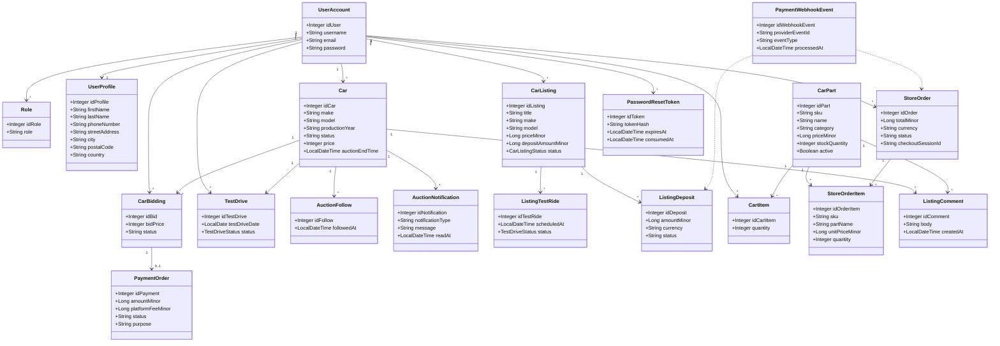
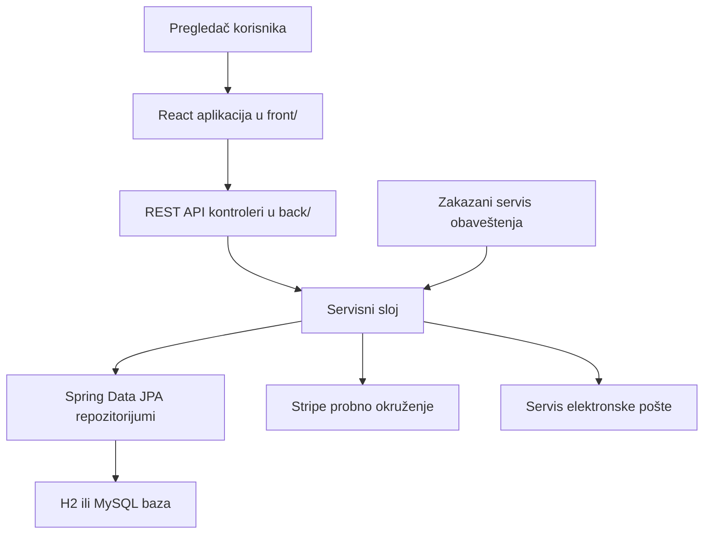

# Autostrada Auctions - projektna dokumentacija

Predmet: Eksploatacija, održavanje i nadogradnja informacionih sistema  
Student: David Subotin IT-40/2022  
GitHub repozitorijum: https://github.com/DavidSubotinDS/SubotinMotors  
Mesto i godina: Novi Sad, 2026.

## Sadržaj

1. Opis realnog sistema  
2. Korišćene tehnologije  
3. UML dijagrami  
   3.1 Dijagram slučajeva upotrebe  
   3.2 Dijagram klasa  
4. Baza podataka  
5. Opis predloženog rešenja  
6. Zaključak  
Literatura i izvori

## 1. Opis realnog sistema

Razvoj digitalnih platformi značajno je promenio način na koji se vozila, rezervni delovi i prateće usluge nude kupcima. Tradicionalna prodaja polovnih automobila često zavisi od odvojenih oglasnih portala, telefonske komunikacije, neformalnih dogovora i ručnog praćenja ponuda. Takav pristup otežava proveru dostupnosti vozila, status aukcije, istoriju ponuda, dogovor oko probne vožnje i uvid u tok prodaje.

Predmet ovog projekta jeste razvoj veb aplikacije Autostrada Auctions, informacionog sistema namenjenog tržištu automobila, aukcijskoj prodaji, oglasima sa fiksnom cenom i prodavnici auto-delova. Sistem objedinjuje javni katalog, korisnički nalog, administrativni panel, korpu, porudžbine, plaćanja i komunikaciju kroz komentare. Time se omogućava da se važni procesi vode kroz jedinstvenu aplikaciju, umesto kroz nepovezane poruke i ručne evidencije.

Sa aspekta realnog sistema, aplikacija povezuje četiri osnovne grupe učesnika. Posetilac može da pregleda javno dostupne automobile, oglase sa fiksnom cenom i auto-delove. Registrovani korisnik može da upravlja profilom, postavlja automobile, daje ponude, zakazuje probne vožnje, prati aukcije, koristi korpu i pregleda porudžbine. Prodavac upravlja sopstvenim vozilima i zahtevima zainteresovanih kupaca. Administrator nadgleda korisnike, odobrava ili odbija automobile, upravlja prodavnicom auto-delova i pregleda transakcije.

Poslovni procesi koji se modeluju u aplikaciji obuhvataju registraciju i prijavu korisnika, oporavak lozinke, objavljivanje i moderaciju automobila, aukcijsku prodaju, zakazivanje probne vožnje, praćenje aukcija, slanje obaveštenja, kupovinu auto-delova, rezervaciju zaliha, plaćanje putem spoljnog sistema i obradu statusa porudžbine. Poseban značaj ima činjenica da se istorijski zapisi ne brišu proizvoljno. Ponude, porudžbine, plaćanja, komentari i zahtevi za probnu vožnju čuvaju se kroz statuse, jer predstavljaju poslovnu istoriju sistema.

Sistem je prilagođen i demonstracionom radu. U bazi se nalaze početni podaci za administratora, običnog korisnika i nekoliko demonstracionih naloga, čime je omogućena provera različitih uloga i tokova rada bez dodatnog ručnog unosa. Razvijena aplikacija ne obrađuje stvarna plaćanja, već koristi probno okruženje sistema Stripe, što je pogodno za bezbednu školsku demonstraciju.

## 2. Korišćene tehnologije

Tehnološka osnova aplikacije podeljena je na serverski deo u direktorijumu `back/` i klijentski deo u direktorijumu `front/`. Ovakva podela omogućava jasnije razdvajanje odgovornosti: serverski deo sadrži poslovnu logiku, bezbednost, pristup podacima i programske interfejse, dok klijentski deo sadrži korisnički interfejs i komunikaciju sa API slojem.

### 2.1 Klijentski deo aplikacije

Korisnički interfejs implementiran je pomoću biblioteke React. React je izabran zato što omogućava izgradnju interfejsa kroz komponente, ponovno korišćenje elemenata i lakše održavanje stanja prikaza, što je u skladu sa zvaničnom React dokumentacijom. U aplikaciji su izdvojene zajedničke komponente kao što su `AppLayout`, `Navbar`, `DashboardSidebar`, `PageHeader`, `Card`, `Button`, `Alert`, `EmptyState`, `LoadingState`, tabele i komponente za komentare.

Za razvoj i izgradnju klijentskog dela koristi se Vite. Prema zvaničnom vodiču za Vite, ovaj alat obezbeđuje brz razvojni server i efikasnu produkcionu izgradnju aplikacije. Navigacija je rešena pomoću React Router biblioteke, čija zvanična dokumentacija opisuje rutiranje u React aplikacijama. Za ikonice u navigaciji, karticama i akcijama koristi se paket `lucide-react`. Komunikacija sa serverskim delom izdvojena je u servisni sloj. Adresa serverskog API-ja podešava se promenljivom okruženja `VITE_API_BASE_URL`, čime se izbegava ugrađivanje adresa direktno u komponente.

U klijentskom delu nisu korišćeni gotovi sistemi komponenti kao što su Material UI, niti pomoćni CSS okviri kao što je Tailwind CSS. Vizuelni sloj je izrađen kroz sopstvene React komponente i ručno pisane CSS stilove organizovane u `front/src/styles/index.css`. Takav pristup omogućava da izgled aplikacije bude prilagođen domenu sistema: javne stranice služe za pregled tržišta, dok korisnički i administratorski delovi koriste pregledne tabele, statuse i forme za rad sa većim brojem zapisa.

### 2.2 Serverski deo aplikacije

Serverski deo implementiran je pomoću Java 17 platforme i radnog okvira Spring Boot. Spring Boot se, prema zvaničnoj dokumentaciji, koristi za izgradnju samostalnih aplikacija zasnovanih na Spring ekosistemu, uz ugrađenu podršku za konfiguraciju, veb sloj, testiranje i pokretanje aplikacije. U projektu se koristi Spring MVC za obradu HTTP zahteva i izlaganje REST (engl. Representational State Transfer) API ruta.

Bezbednost je implementirana pomoću Spring Security tehnologije, u skladu sa namenom ovog projekta opisanom u zvaničnoj Spring Security dokumentaciji. Pravila pristupa odvajaju javne rute, korisničke rute i administratorske rute. Javne rute su dostupne bez prijave, korisničke rute zahtevaju autentifikovanog korisnika, a administratorske rute zahtevaju administratorsku ulogu. Lozinke se čuvaju kao BCrypt heš vrednosti, dok se dodatne provere vlasništva sprovode u servisnom sloju.

Za pristup podacima koristi se Spring Data JPA, čija dokumentacija opisuje rad sa JPA repozitorijumima, dok Hibernate obavlja mapiranje entiteta na relacione tabele. Kontroleri ne sadrže poslovna pravila, već pozivaju servise koji proveravaju statuse, vlasništvo, rokove aukcija, dostupnost zaliha i dozvoljene prelaze stanja. API odgovori se oblikuju kroz DTO (engl. Data Transfer Object) klase, čime se sprečava direktno izlaganje JPA entiteta i osetljivih podataka.

### 2.3 Baza podataka i migracije

Za lokalni razvoj koristi se H2 baza podataka u režimu kompatibilnosti sa MySQL-om, dok je za okruženje slično produkcionom dostupan MySQL profil. Obe baze su dokumentovane kroz zvanične izvore proizvođača. Struktura baze se ne kreira automatski iz entiteta, već se kontroliše kroz Flyway migracije. Prema dokumentaciji alata Flyway, migracije omogućavaju verzionisano i ponovljivo upravljanje šemom baze podataka.

U konfiguraciji aplikacije podešeno je `spring.jpa.hibernate.ddl-auto=validate`, što znači da Hibernate proverava usklađenost entiteta i baze, ali ne menja šemu samostalno. Ovakav pristup smanjuje rizik od nekontrolisanih promena nad bazom i čini evoluciju šeme jasnom kroz SQL migracije u direktorijumu `back/src/main/resources/db/migration`.

### 2.4 Plaćanja i spoljni servisi

Plaćanja u prodavnici auto-delova i depoziti za oglase sa fiksnom cenom povezani su sa probnim okruženjem sistema Stripe. Prema zvaničnoj Stripe dokumentaciji, potpisani *webhook* događaji se koriste za pouzdanu obradu promena statusa plaćanja. U ovoj aplikaciji preusmerenje korisnika na stranicu uspeha nije izvor istine za plaćanje; status porudžbine se menja tek nakon obrade verifikovanog događaja.

Slanje elektronske pošte za oporavak lozinke podržano je kroz dva režima. U lokalnom razvoju linkovi za resetovanje se beleže u log, dok se za SMTP režim podešavaju odgovarajuće promenljive okruženja. Time se postiže bezbedna podrazumevana konfiguracija za razvoj i mogućnost proširenja u realnijem okruženju.

### 2.5 Dodatni alati

Za izgradnju serverskog dela koristi se Maven Wrapper, čime se obezbeđuje ponovljivo pokretanje komandi bez oslanjanja na globalnu instalaciju Maven alata. Testiranje je zasnovano na JUnit, Spring Boot Test i MockMvc alatima. Klijentski deo koristi npm skripte za instalaciju zavisnosti, razvojni server, produkcionu izgradnju i osnovne testove.

## 3. UML dijagrami

UML (engl. Unified Modeling Language) dijagrami prikazuju funkcionalnu i strukturnu sliku sistema. Dijagram slučajeva upotrebe opisuje interakcije između aktera i sistema, dok dijagram klasa prikazuje najvažnije domenske klase i njihove odnose. Dijagrami su dati u Mermaid notaciji kako bi ostali čitljivi u repozitorijumu i mogli da se izvezu u grafički oblik po potrebi.

### 3.1 Dijagram slučajeva upotrebe

Dijagram slučajeva upotrebe prikazuje javne tokove, korisničke tokove, prodavca, administratora i spoljne sisteme. Radi potpunijeg prikaza, glavni tokovi su razloženi na konkretnije slučajeve upotrebe, dok su pomoćne radnje prikazane vezama `include` i `extend`. Posetilac ima pristup samo javnom pregledu i registraciji, dok se sve radnje koje menjaju podatke izvršavaju tek nakon autentifikacije ili administratorske autorizacije.

```mermaid
flowchart LR
  Visitor["Posetilac"]
  User["Registrovani korisnik"]
  Seller["Prodavac"]
  Admin["Administrator"]
  Stripe["Stripe"]
  Mail["Servis elektronske pošte"]

  subgraph System["Autostrada Auctions"]
    direction TB

    subgraph Public["Javne funkcionalnosti"]
      direction TB
      Register([Registracija naloga])
      Login([Prijava])
      Logout([Odjava])
      Reset([Oporavak lozinke])
      SendReset([Slanje linka za oporavak])
      Browse([Pregled javnog kataloga])
      Search([Pretraga i filtriranje])
      CarDetails([Pregled detalja automobila])
      ListingDetails([Pregled oglasa sa fiksnom cenom])
      StoreBrowse([Pregled prodavnice auto-delova])
      PartDetails([Pregled detalja auto-dela])
      SellerProfile([Pregled javnog profila prodavca])
    end

    subgraph Account["Korisnički nalog"]
      direction TB
      Profile([Pregled i izmena profila])
      EditProfile([Izmena ličnih podataka])
      Shipping([Izmena adrese za isporuku])
      ProfileImage([Postavljanje slike profila])
      MyOrders([Pregled mojih porudžbina])
      OrderDetails([Pregled detalja porudžbine])
    end

    subgraph Marketplace["Aukcije, oglasi i komunikacija"]
      direction TB
      CreateAuction([Postavljanje automobila])
      UploadCarImages([Dodavanje slika automobila])
      ManageAuction([Uređivanje sopstvenih automobila])
      ManageListing([Upravljanje oglasima sa fiksnom cenom])
      Bid([Davanje ponude])
      CancelBid([Otkazivanje ponude])
      Follow([Praćenje aukcije])
      Notifications([Pregled obaveštenja])
      RequestRide([Zakazivanje probne vožnje])
      DecideRide([Prihvatanje ili odbijanje probne vožnje])
      RescheduleRide([Promena termina probne vožnje])
      Comments([Komentarisanje automobila i delova])
      CommentImage([Dodavanje slike uz komentar])
    end

    subgraph Store["Prodavnica i plaćanja"]
      direction TB
      Cart([Upravljanje korpom])
      AddCart([Dodavanje proizvoda u korpu])
      UpdateCart([Izmena količine u korpi])
      RemoveCart([Uklanjanje proizvoda iz korpe])
      Checkout([Plaćanje porudžbine])
      CreateOrder([Kreiranje porudžbine])
      ReserveStock([Rezervacija zaliha])
      StripeSession([Kreiranje Stripe sesije])
      Deposit([Plaćanje depozita za oglas])
      Webhook([Obrada potpisanog Stripe događaja])
      UpdatePaymentStatus([Ažuriranje statusa porudžbine ili depozita])
    end

    subgraph Administration["Administracija sistema"]
      direction TB
      AdminUsers([Upravljanje korisnicima])
      EditUser([Izmena korisničkog profila])
      AssignRole([Dodela administratorske uloge])
      AdminCars([Moderacija automobila i ponuda])
      ApproveCar([Odobravanje ili odbijanje automobila])
      DecideBid([Prihvatanje ili odbijanje ponude])
      AdminParts([Upravljanje auto-delovima])
      AddPart([Dodavanje novog auto-dela])
      EditPart([Izmena auto-dela i zaliha])
      AdminOrders([Pregled porudžbina i transakcija])
      ViewAllOrders([Pregled svih porudžbina])
      AdminOrderDetails([Pregled detalja porudžbine])
      ViewTransactions([Pregled istorije plaćanja])
    end
  end

  Visitor --> Browse
  Visitor --> Register
  Visitor --> Login
  Visitor --> Reset
  Visitor --> StoreBrowse
  Visitor --> SellerProfile

  User --> Profile
  User --> Bid
  User --> CancelBid
  User --> RequestRide
  User --> RescheduleRide
  User --> Follow
  User --> Notifications
  User --> Deposit
  User --> Cart
  User --> Checkout
  User --> MyOrders
  User --> Comments
  User --> Logout

  Seller --> CreateAuction
  Seller --> ManageAuction
  Seller --> ManageListing
  Seller --> DecideRide

  Admin --> AdminUsers
  Admin --> AdminCars
  Admin --> AdminParts
  Admin --> AdminOrders

  Mail --> SendReset
  Stripe --> StripeSession
  Stripe --> Webhook

  Browse -.->|include| Search
  CarDetails -.->|extend| Browse
  ListingDetails -.->|extend| Browse
  PartDetails -.->|extend| StoreBrowse
  Reset -.->|include| SendReset

  Profile -.->|include| EditProfile
  Profile -.->|include| Shipping
  ProfileImage -.->|extend| Profile
  OrderDetails -.->|extend| MyOrders

  CreateAuction -.->|include| UploadCarImages
  UploadCarImages -.->|extend| ManageAuction
  CancelBid -.->|extend| Bid
  Follow -.->|include| Notifications
  RescheduleRide -.->|extend| RequestRide
  CommentImage -.->|extend| Comments

  Cart -.->|include| AddCart
  Cart -.->|include| UpdateCart
  Cart -.->|include| RemoveCart
  Checkout -.->|include| CreateOrder
  Checkout -.->|include| ReserveStock
  Checkout -.->|include| StripeSession
  Deposit -.->|include| StripeSession
  Webhook -.->|include| UpdatePaymentStatus

  AdminUsers -.->|include| EditUser
  AdminUsers -.->|include| AssignRole
  AdminCars -.->|include| ApproveCar
  AdminCars -.->|include| DecideBid
  AdminParts -.->|include| AddPart
  AdminParts -.->|include| EditPart
  AdminOrders -.->|include| ViewAllOrders
  AdminOrders -.->|include| AdminOrderDetails
  AdminOrders -.->|include| ViewTransactions
```



Slika 1 - Prošireni dijagram slučajeva upotrebe aplikacije Autostrada Auctions

Tekstualni opis glavnih slučajeva upotrebe dat je u nastavku.

#### 1. Slučaj upotrebe: Pregled javnog kataloga

Kratak opis:

Posetilac pregleda javno dostupnu ponudu automobila, oglasa sa fiksnom cenom i auto-delova.

Učesnici:

Posetilac, registrovani korisnik

Uslovi koji moraju biti zadovoljeni pre izvršavanja:

Aplikacija mora biti dostupna, a javni katalog mora moći da prikaže aktivne ili demonstracione zapise.

Opis:

Korisnik pristupa početnoj strani, katalogu automobila, stranici oglasa ili prodavnici auto-delova. Sistem prikazuje samo sadržaj koji je javno dostupan i nalazi se u odgovarajućem statusu. Korisnik može da koristi pretragu, sortiranje i paginaciju, kao i da otvori detalje izabranog automobila, oglasa, dela ili javnog profila prodavca.

Uslovi koji moraju biti zadovoljeni nakon izvršavanja:

Javni podaci su uspešno prikazani korisniku, bez izmene stanja sistema.

#### 2. Slučaj upotrebe: Registracija naloga

Kratak opis:

Posetilac kreira novi korisnički nalog i unosi osnovne podatke profila.

Učesnici:

Posetilac

Uslovi koji moraju biti zadovoljeni pre izvršavanja:

Korisnik ne sme već biti prijavljen u sistem, a korisničko ime i adresa elektronske pošte moraju biti jedinstveni.

Opis:

Korisnik unosi podatke naloga, lozinku i osnovne podatke profila. Sistem validira format podataka, proverava jedinstvenost korisničkog imena i elektronske pošte, čuva lozinku kao BCrypt heš vrednost i novom nalogu dodeljuje osnovnu korisničku ulogu.

[Izuzetak: Korisničko ime ili elektronska pošta već postoje]

Ukoliko korisnik unese korisničko ime ili adresu elektronske pošte koji su već registrovani, sistem neće kreirati novi nalog i prikazaće odgovarajuću grešku.

Uslovi koji moraju biti zadovoljeni nakon izvršavanja:

Korisnički nalog i profil su uspešno kreirani i spremni za prijavu.

#### 3. Slučaj upotrebe: Prijava i odjava

Kratak opis:

Korisnik se prijavljuje u sistem ili završava postojeću sesiju odjavom.

Učesnici:

Registrovani korisnik, administrator

Uslovi koji moraju biti zadovoljeni pre izvršavanja:

Za prijavu mora postojati registrovan nalog sa ispravnim kredencijalima. Za odjavu korisnik mora biti prijavljen u sistem.

Opis:

Korisnik unosi korisničko ime i lozinku. Sistem proverava kredencijale preko Spring Security mehanizma i, u slučaju uspešne provere, uspostavlja korisničku sesiju sa odgovarajućim pravima pristupa. Kada korisnik izabere odjavu, sistem završava trenutnu sesiju.

[Izuzetak: Neispravni kredencijali]

Ukoliko su korisničko ime ili lozinka neispravni, sistem ne dozvoljava prijavu i ne otvara zaštićene korisničke ili administratorske funkcionalnosti.

Uslovi koji moraju biti zadovoljeni nakon izvršavanja:

Korisnik je uspešno prijavljen u sistem ili je postojeća sesija uspešno završena.

#### 4. Slučaj upotrebe: Oporavak lozinke

Kratak opis:

Korisnik pokreće postupak promene zaboravljene lozinke.

Učesnici:

Registrovani korisnik, servis elektronske pošte

Uslovi koji moraju biti zadovoljeni pre izvršavanja:

Korisnik mora uneti korisničko ime ili adresu elektronske pošte, a sistem mora moći da generiše vremenski ograničen token za oporavak.

Opis:

Korisnik šalje zahtev za oporavak lozinke. Ako nalog postoji, sistem generiše token, čuva samo njegovu heš vrednost i priprema link za promenu lozinke. U lokalnom režimu link se beleži u log, dok se u SMTP režimu može poslati elektronskom poštom. Korisnik zatim otvara link, unosi novu lozinku i sistem troši token nakon uspešne promene.

[Izuzetak: Nevažeći ili istekao token]

Ukoliko je token istekao, već iskorišćen ili ne postoji, sistem neće dozvoliti promenu lozinke.

Uslovi koji moraju biti zadovoljeni nakon izvršavanja:

Lozinka je uspešno promenjena, a token za oporavak je označen kao iskorišćen.

#### 5. Slučaj upotrebe: Upravljanje profilom

Kratak opis:

Korisnik pregleda i menja podatke svog profila.

Učesnici:

Registrovani korisnik

Uslovi koji moraju biti zadovoljeni pre izvršavanja:

Korisnik mora biti prijavljen u sistem.

Opis:

Korisnik otvara korisnički profil, pregleda lične podatke, kontakt podatke, adresu za isporuku i sliku profila. Nakon izmene podataka sistem validira unos, proverava dozvoljeni format slike ako je slika poslata i čuva ažurirane podatke profila.

[Izuzetak: Neispravni podaci profila]

Ukoliko korisnik unese podatke u neispravnom formatu ili pokuša da pošalje sliku nedozvoljenog tipa, sistem odbija izmenu.

Uslovi koji moraju biti zadovoljeni nakon izvršavanja:

Podaci profila su uspešno prikazani ili ažurirani.

#### 6. Slučaj upotrebe: Postavljanje automobila na aukciju

Kratak opis:

Prodavac postavlja automobil koji nakon toga čeka administratorsku proveru.

Učesnici:

Registrovani korisnik, prodavac

Uslovi koji moraju biti zadovoljeni pre izvršavanja:

Korisnik mora biti prijavljen u sistem i mora uneti obavezne podatke o automobilu.

Opis:

Prodavac popunjava podatke o automobilu, ceni, godini proizvodnje, trajanju aukcije i pratećim slikama. Sistem validira podatke, proverava realnost godine proizvodnje i dozvoljene tipove slika, zatim čuva automobil u stanju čekanja. Administrator naknadno može da odobri ili odbije objavu.

[Izuzetak: Neispravni podaci ili slika]

Ukoliko su podaci nevalidni, godina proizvodnje nije dozvoljena ili slika nema ispravan format, sistem neće sačuvati automobil.

Uslovi koji moraju biti zadovoljeni nakon izvršavanja:

Automobil je uspešno sačuvan i čeka administratorsku moderaciju.

#### 7. Slučaj upotrebe: Davanje i otkazivanje ponude

Kratak opis:

Korisnik učestvuje u aukciji davanjem ponude za aktivan automobil.

Učesnici:

Registrovani korisnik

Uslovi koji moraju biti zadovoljeni pre izvršavanja:

Korisnik mora biti prijavljen, aukcija mora biti aktivna, rok aukcije ne sme biti istekao, a korisnik ne sme biti vlasnik automobila.

Opis:

Korisnik unosi iznos ponude za izabrani automobil. Sistem proverava status automobila, rok aukcije, vlasništvo i validnost iznosa. Ispravna ponuda se čuva u istoriji licitiranja. Korisnik može da otkaže sopstvenu ponudu dok je ona u dozvoljenom stanju, dok administrator može da prihvati ili odbije ponude u okviru toka moderacije.

[Izuzetak: Ponuda nije dozvoljena]

Ukoliko je aukcija završena, automobil nije aktivan, iznos nije validan ili korisnik pokušava da licitira za sopstveni automobil, sistem neće prihvatiti ponudu.

Uslovi koji moraju biti zadovoljeni nakon izvršavanja:

Ponuda je uspešno evidentirana ili je postojeća ponuda ažurirana odgovarajućim statusom.

#### 8. Slučaj upotrebe: Zakazivanje probne vožnje

Kratak opis:

Kupac šalje zahtev za probnu vožnju, a prodavac odlučuje o zahtevu.

Učesnici:

Registrovani korisnik, prodavac

Uslovi koji moraju biti zadovoljeni pre izvršavanja:

Korisnik mora biti prijavljen, automobil ili oglas mora postojati, a traženi termin mora biti u budućnosti.

Opis:

Kupac bira vozilo i predlaže termin probne vožnje. Sistem proverava validnost termina i čuva zahtev u stanju čekanja. Prodavac, kao vlasnik vozila, pregleda pristigle zahteve i može da ih prihvati, odbije ili otkaže. Kupac može da izmeni termin kada je to dozvoljeno pravilima toka.

[Izuzetak: Nevalidan ili dupliran termin]

Ukoliko je termin u prošlosti ili već postoji isti zahtev za istog korisnika, vozilo i datum, sistem neće kreirati novi zahtev.

Uslovi koji moraju biti zadovoljeni nakon izvršavanja:

Zahtev za probnu vožnju je uspešno evidentiran ili mu je promenjen status.

#### 9. Slučaj upotrebe: Praćenje aukcija i obaveštenja

Kratak opis:

Korisnik prati aukcije i dobija obaveštenja kada se aukcija približava kraju.

Učesnici:

Registrovani korisnik, sistem

Uslovi koji moraju biti zadovoljeni pre izvršavanja:

Korisnik mora biti prijavljen, a aukcija mora postojati u sistemu.

Opis:

Korisnik označava aukciju koju želi da prati. Sistem čuva vezu između korisnika i aukcije. Zakazani servis periodično proverava aukcije koje se približavaju završetku i kreira obaveštenja za korisnike koji ih prate, uz sprečavanje duplih obaveštenja za istu aukciju i tip poruke.

Uslovi koji moraju biti zadovoljeni nakon izvršavanja:

Aukcija je dodata u listu praćenih aukcija, a relevantna obaveštenja su dostupna korisniku.

#### 10. Slučaj upotrebe: Kupovina auto-delova i upravljanje korpom

Kratak opis:

Korisnik dodaje auto-delove u korpu, menja količine i priprema porudžbinu.

Učesnici:

Registrovani korisnik

Uslovi koji moraju biti zadovoljeni pre izvršavanja:

Korisnik mora biti prijavljen, proizvod mora biti aktivan, a tražena količina mora biti dostupna na stanju.

Opis:

Korisnik pregleda prodavnicu auto-delova i dodaje izabrane proizvode u korpu. Ako isti proizvod već postoji u korpi, sistem spaja stavke i ažurira količinu. Korisnik može da menja količinu ili ukloni stavku iz korpe, dok sistem proverava zalihe i izračunava ukupnu vrednost.

[Izuzetak: Nedovoljna količina proizvoda na stanju]

Ukoliko korisnik pokuša da doda ili poveća količinu iznad dostupnih zaliha, sistem neće dozvoliti izmenu korpe.

Uslovi koji moraju biti zadovoljeni nakon izvršavanja:

Korpa je uspešno ažurirana i spremna za pokretanje plaćanja.

#### 11. Slučaj upotrebe: Plaćanje porudžbine i obrada Stripe događaja

Kratak opis:

Korisnik pokreće plaćanje porudžbine, a sistem obrađuje potvrdu preko Stripe webhook događaja.

Učesnici:

Registrovani korisnik, Stripe, sistem

Uslovi koji moraju biti zadovoljeni pre izvršavanja:

Korpa mora sadržati proizvode, korisnik mora imati adresu za isporuku, a proizvodi moraju biti dostupni na stanju.

Opis:

Korisnik pokreće checkout proces. Sistem proverava korpu, kreira porudžbinu, čuva snimak adrese za isporuku i stavki porudžbine, rezerviše zalihe i kreira Stripe sandbox sesiju za plaćanje. Nakon plaćanja Stripe šalje potpisani webhook događaj. Sistem proverava potpis, obrađuje događaj idempotentno i ažurira status porudžbine ili depozita. Ako plaćanje istekne ili ne uspe, rezervisana količina se vraća na stanje.

[Izuzetak: Neuspešno plaćanje ili nevalidan webhook]

Ukoliko plaćanje ne uspe, istekne ili webhook potpis nije validan, sistem ne označava porudžbinu kao plaćenu.

Uslovi koji moraju biti zadovoljeni nakon izvršavanja:

Porudžbina je uspešno plaćena i evidentirana ili je neuspešan pokušaj obrađen bez narušavanja zaliha.

#### 12. Slučaj upotrebe: Administracija sistema

Kratak opis:

Administrator nadgleda korisnike, automobile, ponude, auto-delove, porudžbine i transakcije.

Učesnici:

Administrator

Uslovi koji moraju biti zadovoljeni pre izvršavanja:

Administrator mora biti prijavljen u sistem i mora imati administratorsku ulogu.

Opis:

Administrator pristupa administrativnom delu aplikacije. Sistem prikazuje funkcionalnosti za upravljanje korisnicima, dodelu uloga, moderaciju automobila, pregled i odlučivanje o ponudama, upravljanje zalihama auto-delova, pregled porudžbina i pregled istorijskih transakcija. Podaci koji predstavljaju poslovnu istoriju ne brišu se proizvoljno, već se nad njima vrši pregled ili kontrolisana promena statusa.

[Izuzetak: Korisnik nema administratorska prava]

Ukoliko neprijavljen korisnik ili običan registrovani korisnik pokuša da pristupi administratorskim rutama, sistem odbija pristup.

Uslovi koji moraju biti zadovoljeni nakon izvršavanja:

Izabrana administratorska akcija je uspešno izvršena, a istorijski podaci ostaju evidentirani u sistemu.

### 3.2 Dijagram klasa

Dijagram klasa prikazuje najvažnije domenske entitete. Radi preglednosti nisu prikazana sva polja, već atributi koji objašnjavaju identitet, status i ključne veze između objekata. Slike i prilozi su izdvojeni u posebne entitete kako bi se domenski objekti i binarni sadržaj održavali odvojeno.



Slika 2 - Dijagram klasa aplikacije Autostrada Auctions

Centralni entitet sistema je `UserAccount`, jer se na korisnički nalog vezuju profil, uloge, automobili, ponude, korpa, porudžbine i tokeni za oporavak lozinke. Entitet `Role` omogućava autorizaciju po ulogama, dok `UserProfile` čuva lične podatke i adresu za isporuku. Aukcijski tok čine `Car`, `CarBidding`, `TestDrive`, `AuctionFollow` i `AuctionNotification`. Tok oglasa sa fiksnom cenom čine `CarListing`, `ListingTestRide` i `ListingDeposit`.

Prodavnica auto-delova zasniva se na entitetima `CarPart`, `CartItem`, `StoreOrder` i `StoreOrderItem`. Porudžbina čuva snimak naziva, šifre, cene i količine proizvoda u trenutku kupovine, čime se istorija porudžbine ne menja čak ni kada se proizvod kasnije izmeni. Plaćanja i revizija događaja modeluju se kroz `PaymentOrder`, `ListingDeposit` i `PaymentWebhookEvent`. Komentari se čuvaju u entitetu `ListingComment`, pri čemu komentar može biti vezan za automobil ili za auto-deo, ali ne za oba objekta istovremeno.

## 4. Baza podataka

U projektu je primenjen pristup zasnovan na kontrolisanim migracijama. U poređenju sa čistim *code-first* pristupom, gde se šema baze generiše neposredno iz klasa, ovde je šema eksplicitno opisana SQL migracijama. U poređenju sa čistim *database-first* pristupom, entiteti nisu ručno izvedeni iz postojeće baze, već su razvijani zajedno sa migracijama. Zbog toga se pristup može opisati kao kombinovani model: domenski model je implementiran kroz JPA entitete, dok je evolucija baze vođena Flyway migracijama.

Proces rada sa bazom obuhvata sledeće korake. Prvo se definiše ili izmeni domenski entitet u serverskom kodu. Zatim se kreira odgovarajuća Flyway migracija sa novom tabelom, kolonom, indeksom, ograničenjem ili početnim podacima. Pri pokretanju aplikacije Flyway proverava tabelu istorije migracija i izvršava migracije koje još nisu primenjene. Nakon toga Hibernate proverava da li se entiteti slažu sa šemom baze, jer je automatsko menjanje šeme isključeno.

Najvažnije grupe tabela su prikazane u nastavku.

| Grupa | Tabele | Namena |
| --- | --- | --- |
| Korisnici i uloge | `tb_user`, `tb_role`, `tb_user_profile`, `tb_profile_picture`, `tb_password_reset_token` | Čuvanje naloga, uloga, profila, slika profila i tokena za oporavak lozinke. |
| Aukcije | `tb_car`, `tb_car_picture`, `tb_car_bid`, `tb_test_drive`, `tb_auction_follow`, `tb_auction_notification` | Objavljivanje automobila, licitiranje, probne vožnje, praćenje aukcija i obaveštenja. |
| Oglasi sa fiksnom cenom | `tb_car_listing`, `tb_car_listing_picture`, `tb_listing_test_ride`, `tb_listing_deposit` | Prodaja vozila po fiksnoj ceni, zakazivanje obilaska i plaćanje depozita. |
| Prodavnica auto-delova | `tb_car_part`, `tb_cart_item`, `tb_store_order`, `tb_store_order_item` | Katalog delova, korpa, porudžbine i stavke porudžbina. |
| Plaćanja | `tb_payment_account`, `tb_payment_order`, `tb_payment_webhook_event` | Evidencija istorijskih plaćanja, identifikatora pružaoca plaćanja i obrađenih događaja. |
| Komentari | `tb_listing_comment` | Komentari na automobile i auto-delove, uz opcionu sliku komentara. |

Integritet podataka obezbeđuje se primarnim ključevima, stranim ključevima, jedinstvenim ograničenjima i proverama vrednosti. Na primer, korisničko ime i adresa elektronske pošte moraju biti jedinstveni, jedna stavka korpe može postojati samo jednom za isti par korisnika i proizvoda, cena proizvoda mora biti veća od nule, a komentar mora biti vezan ili za automobil ili za auto-deo. Takva ograničenja sprečavaju nevalidna stanja i pre nego što se podaci obrade u servisnom sloju.

Migracije od `V1` do `V16` pokrivaju početnu šemu, plaćanja, proširenje statusa, probne vožnje, demonstracione podatke, oporavak lozinke, praćenje aukcija, prodavnicu delova, komentare, slike komentara, strukturisanu adresu, oglase sa fiksnom cenom, depozite, svrhu plaćanja, snimak adrese za isporuku i brendiranje aplikacije. Time se omogućava da se baza izgradi ponovljivo od početka i da se svaka promena može pratiti kroz istoriju projekta.

## 5. Opis predloženog rešenja

Predloženo rešenje zasnovano je na jasnom razdvajanju klijentskog i serverskog dela. Direktorijum `front/` sadrži React aplikaciju koja prikazuje korisnički interfejs, upravlja rutama i poziva API servise. Direktorijum `back/` sadrži Spring Boot aplikaciju, domenske entitete, repozitorijume, servise, kontrolere, bezbednosnu konfiguraciju, migracije i testove.

### 5.1 Arhitektura sistema

Sistem je organizovan kroz nekoliko slojeva. Klijentski sloj prikazuje stranice i komponente. API sloj prima HTTP zahteve i vraća DTO odgovore. Servisni sloj sadrži poslovna pravila, dok repozitorijumski sloj omogućava pristup bazi podataka. Integracioni sloj obuhvata Stripe, elektronsku poštu i zakazani servis za obaveštenja o aukcijama.



Slika 3 - Arhitektura predloženog rešenja

Ovakva arhitektura omogućava da React bude ciljna tehnologija korisničkog interfejsa, dok Spring Boot zadržava odgovornost za validaciju, autorizaciju i poslovna pravila. Nekadašnji JSP prikazi su uklonjeni, a stare MVC rute postoje samo kao kompatibilni sloj koji preusmerava korisnika ka odgovarajućim React rutama.

### 5.2 Javni deo sistema

Javni deo sistema obuhvata početnu stranu, katalog aukcija, detalje automobila, oglase sa fiksnom cenom, katalog auto-delova, detalje proizvoda i javni profil prodavca. Posetioci mogu da pretražuju i pregledaju podatke bez prijave, ali radnje koje menjaju stanje sistema zahtevaju autentifikaciju.

Podaci za javne stranice dobijaju se preko ruta `/api/public/**`. API vraća samo podatke potrebne za prikaz, kao što su osnovni podaci o vozilu, cena, status, slika, komentari i podaci o prodavcu koji smeju biti javno prikazani. Osetljivi podaci, poput lozinki i internih identifikatora plaćanja, ne šalju se klijentskom delu.

### 5.3 Korisnički deo sistema

Korisnički deo omogućava pregled i izmenu profila, postavljanje automobila, upravljanje sopstvenim aukcijama, postavljanje oglasa sa fiksnom cenom, praćenje aukcija, pregled obaveštenja, zakazivanje probne vožnje, davanje ponuda, plaćanje depozita, upravljanje korpom i pregled porudžbina. Navigacija korisničkog dela organizovana je kroz bočnu navigaciju koja je pripremljena za različite uloge.

Radnje korisnika se proveravaju na serverskoj strani. Vlasnik može menjati samo sopstveni automobil ili oglas. Kupac ne može dati ponudu za sopstveno vozilo. Probna vožnja se ne može zakazati u prošlosti. Ponuda se ne prihvata ako je aukcija istekla ili automobil nije aktivan. Na ovaj način se sprečava da klijentski interfejs bude jedini sloj zaštite.

### 5.4 Administrativni deo sistema

Administrativni deo omogućava pregled korisnika, izmenu profila, dodelu administratorske uloge, moderaciju automobila, odobravanje ili odbijanje ponuda, upravljanje auto-delovima, pregled porudžbina prodavnice i pregled transakcija. Sve administratorske API rute nalaze se pod `/api/admin/**` i zahtevaju odgovarajuću ulogu.

Posebna pažnja posvećena je tome da se istorijski podaci ne menjaju proizvoljno. Porudžbine, stavke porudžbina, plaćanja i događaji plaćanja služe kao poslovna i reviziona evidencija. Zbog toga se za većinu takvih podataka izlaže pregled, dok se promene statusa obavljaju kroz kontrolisane poslovne tokove.

### 5.5 Plaćanja, zalihe i porudžbine

Proces kupovine auto-delova počinje dodavanjem proizvoda u korpu. Kada korisnik pokrene plaćanje, servis proverava dostupnu količinu, kreira porudžbinu, rezerviše zalihe i dobija adresu za plaćanje iz Stripe probnog okruženja. Ukoliko plaćanje uspe, potpisani *webhook* događaj ažurira status porudžbine. Ukoliko plaćanje ne uspe ili istekne, rezervisana količina se vraća na stanje.

Kod porudžbina se čuva snimak adrese za isporuku, naziva proizvoda, šifre, jedinične cene i količine. Takvo rešenje sprečava da se istorija porudžbine promeni kada administrator kasnije izmeni proizvod, cenu ili stanje zaliha. Ovaj princip je važan za tačnost poslovne evidencije.

### 5.6 Bezbednost i validacija

Bezbednosna pravila su centralizovana u Spring Security konfiguraciji i servisnom sloju. API rute za javni sadržaj su otvorene, rute korisničkog dela zahtevaju prijavu, dok administratorske rute zahtevaju administratorsku ulogu. CSRF zaštita je prilagođena API načinu rada, a CORS podešavanje dozvoljava komunikaciju React razvojnog servera sa serverskim delom.

Validacija se sprovodi kroz DTO objekte, entitete, validatore i servisne provere. Godina proizvodnje mora biti realna, cene i količine moraju biti pozitivne, adresa za isporuku mora biti dostupna pre plaćanja, slike moraju imati dozvoljen tip i validan sadržaj, a token za oporavak lozinke mora biti važeći i neiskorišćen.

### 5.7 Korisnički interfejs

React korisnički interfejs projektovan je tako da zameni nekadašnje JSP strane i da omogući dalji razvoj bez mešanja prikaza sa serverskom logikom. Javne stranice koriste kartice za aukcije, oglase i delove, dok detaljne stranice prikazuju glavne podatke, statuse, komentare i dostupne akcije. Korisnički i administratorski delovi koriste tabele, obrasce i statusne oznake radi preglednosti.

Komponente su organizovane tako da se ponavljajući elementi ne dupliraju. Dugmad, kartice, tabele, polja forme, stanja učitavanja, prazna stanja i upozorenja izdvojeni su kao zajednički elementi. API pozivi su izdvojeni iz komponenti u servisne module, čime se postiže čistija podela između prikaza i komunikacije sa serverskim delom.

### 5.8 Pokretanje i provera rada

Serverski deo se pokreće iz direktorijuma `back/` komandom:

```powershell
.\mvnw.cmd spring-boot:run
```

Klijentski deo se pokreće iz direktorijuma `front/` komandama:

```powershell
npm.cmd install
npm.cmd run dev
```

Produkcioni paket klijentskog dela proverava se komandom `npm.cmd run build`, dok se osnovni testovi pokreću komandom `npm.cmd run test`. Serverski testovi se pokreću komandom `.\mvnw.cmd test`. U trenutnoj razvojnoj grani klijentska izgradnja i osnovni testovi uspešno prolaze, dok je pokretanje Maven komandi u sandbox okruženju ograničeno zbog blokiranog pristupa Maven Central repozitorijumu.

## 6. Zaključak

Razvijena aplikacija Autostrada Auctions predstavlja informacioni sistem za digitalno tržište automobila, aukcije, oglase sa fiksnom cenom i prodavnicu auto-delova. Sistem pokriva javno pregledanje ponude, registraciju i prijavu korisnika, oporavak lozinke, korisničke profile, aukcijsko licitiranje, zakazivanje probne vožnje, praćenje aukcija, obaveštenja, komentare, korpu, porudžbine, plaćanja i administratorski nadzor.

U arhitektonskom smislu postignuto je jasno razdvajanje serverskog i klijentskog dela. Spring Boot aplikacija zadržava poslovna pravila, bezbednost, validaciju i rad sa bazom podataka, dok React aplikacija preuzima korisnički interfejs. Uklanjanjem JSP prikaza i uvođenjem REST API sloja stvorena je osnova za moderniji razvoj, lakše održavanje i buduće proširenje korisničkog iskustva.

Baza podataka je organizovana kroz kontrolisane Flyway migracije, čime se obezbeđuje ponovljivo kreiranje šeme i praćenje promena. Važni poslovni zapisi se čuvaju kroz statuse i istoriju, što doprinosi pouzdanosti sistema i boljoj revizionoj evidenciji. Probna integracija sa Stripe servisom omogućava demonstraciju plaćanja bez obrade stvarnih transakcija.

Na osnovu implementiranih funkcionalnosti može se zaključiti da aplikacija ispunjava cilj projekta: obezbeđuje funkcionalno, bezbedno i proširivo rešenje za upravljanje tržištem automobila i auto-delova. Dalji razvoj može obuhvatiti naprednije izveštaje, dodatne testove integracije, produkcionu konfiguraciju elektronske pošte, detaljniju proveru pristupačnosti i dalju vizuelnu doradu React korisničkog interfejsa.

## Literatura i izvori

Spring Boot Documentation. Zvanična dokumentacija Spring Boot projekta. Dostupno na: https://docs.spring.io/spring-boot/. Pristupljeno: 24. 6. 2026.

Spring Security Reference. Zvanična dokumentacija Spring Security projekta. Dostupno na: https://docs.spring.io/spring-security/reference/. Pristupljeno: 24. 6. 2026.

Spring Data JPA Reference Documentation. Zvanična dokumentacija Spring Data JPA projekta. Dostupno na: https://docs.spring.io/spring-data/jpa/reference/. Pristupljeno: 24. 6. 2026.

React Documentation. Zvanična dokumentacija biblioteke React. Dostupno na: https://react.dev/. Pristupljeno: 24. 6. 2026.

React Router Official Documentation. Zvanična dokumentacija biblioteke React Router. Dostupno na: https://reactrouter.com/. Pristupljeno: 24. 6. 2026.

Vite Guide. Zvanični vodič za Vite. Dostupno na: https://vite.dev/guide/. Pristupljeno: 24. 6. 2026.

Redgate Flyway Documentation. Zvanična dokumentacija alata Flyway. Dostupno na: https://documentation.red-gate.com/fd. Pristupljeno: 24. 6. 2026.

Stripe Documentation. Zvanična dokumentacija Stripe platforme. Dostupno na: https://docs.stripe.com/. Pristupljeno: 24. 6. 2026.

H2 Database Documentation. Zvanična dokumentacija H2 baze podataka. Dostupno na: https://www.h2database.com/html/main.html. Pristupljeno: 24. 6. 2026.

MySQL Documentation. Zvanična dokumentacija MySQL sistema za upravljanje bazama podataka. Dostupno na: https://dev.mysql.com/doc/. Pristupljeno: 24. 6. 2026.
